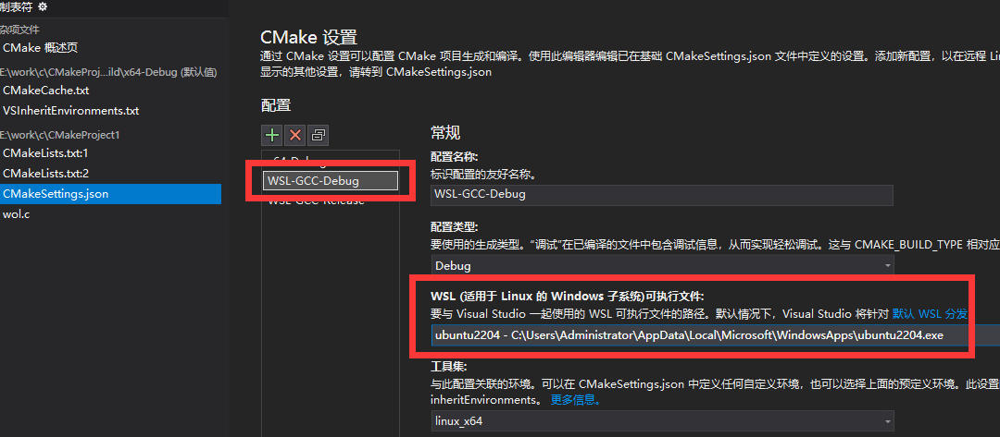
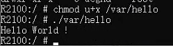
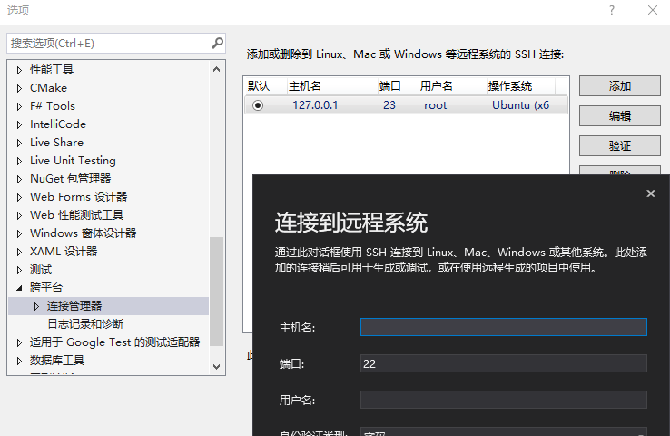
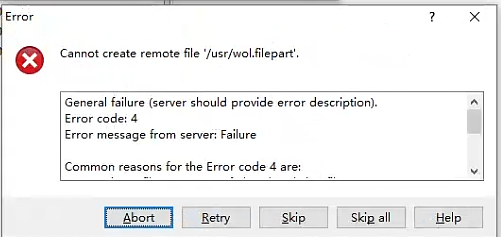
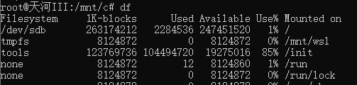
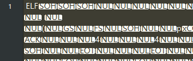
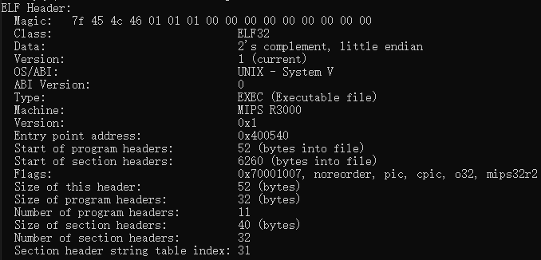

## 目录
1. [硬件准备](#1)
2. [Windows上的开发环境准备](#2)
3. [使用Ubuntu安装MIPSEL架构的交叉编译器](#3)
4. [使用C编写Hello Word!测试](#4)
5. [过程中遇到的问题](#5)
6. [一点感想](#6)


<h2 id='1'>硬件准备</h2>

- 一台基于Linux内核, 采用MIPS架构CPU的路由器, 我的是小米AC2100, 刷了Padavan系统
- 一台支持Windows子系统(WSL)的Windows 10的电脑

<h2 id='2'>Windows上的开发环境准备</h2>

1. 安装[Visual Studio](https://visualstudio.microsoft.com/zh-hans/) 2019.9 或以上版本
2. 为[Visual Studio](https://visualstudio.microsoft.com/zh-hans/)添加Linux开发环境工具集 (安装时已勾选的可跳过) 
    1. 在开始菜单中打开「Visual Studio Installer」 
    2. 找到刚刚安装的Visual Studio 2019, 点击右侧的「修改」按钮
    3. 找到「使用C++的Linux开发」, 并勾选保存
    > 参考资料: [如何修改开发工具集?](https://www.cnblogs.com/MIUMIUBLING/p/16566200.html)

3. 为Windows开启子系统(WSL)并安装Ubuntu
    1. 在Windows功能中启用 「适用于Linux的Windows子系统」和「虚拟机平台」
    2. 在Microsoft Store中搜索 **Ubuntu**, 下载一个Linux发行版, 我的是22.04.2
    3. 安装后, 可按照自己需要[修改root密码](https://blog.csdn.net/ximaiyao1984/article/details/128593271), [设置默认以root启动](https://www.cnblogs.com/oongxu/p/16911759.html), [修改镜像源](https://blog.csdn.net/Erictr/article/details/121729194)等
    > 参考资料: [如何启用Win10的WSL?](https://blog.csdn.net/VXzhangkaiOsLab/article/details/128205285)

4. 为[Visual Studio](https://visualstudio.microsoft.com/zh-hans/)配置跨平台编译
    具体配置方式可参考微软官方教程  
    - [如何在Visual Studio 2019中配置WSL交叉编译环境?](hhttps://devblogs.microsoft.com/cppblog/c-with-visual-studio-2019-and-windows-subsystem-for-linux-wsl/)  
    - [如何在Visual Studio 2022中配置WSL交叉编译环境?](https://learn.microsoft.com/zh-cn/cpp/build/walkthrough-build-debug-wsl2?view=msvc-170)  
    **需要注意的是, 开始菜单中直接搜索「wsl」可以打开一个命令窗口执行Linux命令, 而打开Ubuntu窗口也可以执行命令, 我是在Ubutnu中安装的编译工具, 因此在[Visual Studio](https://visualstudio.microsoft.com/zh-hans/)的「WSL-GCC-Debug」配置中, 「WSL」一栏需要选「Ubuntu2204」**
    

<h2 id='3'>使用Ubuntu安装MIPSEL架构的交叉编译器</h2>  

1. 添加源, 以root权限添加下面两行内容到 /etc/apt/sources.list 文件

    ```
    deb http://ftp.de.debian.org/debian squeeze main  
    deb http://www.emdebian.org/debian/ squeeze main  
    ```

2. 在Ubuntu中依次执行下列命令

    ```
    sudo apt-get update   
    sudo apt-get install emdebian-archive-keyring  
    apt-get install linux-libc-dev-mips-cross libc6-mips-cross libc6-dev-mips-cross binutils-mips-linux-gnu gcc--mipsel-linux-gnu g++-mipsel-linux-gnu  
    ```

3. 检查是否安装成功

    ```
    mipsel-linux-gnu-gcc -dumpmachine 
    ```
    安装正确会输出 **mipsel-linux-gnu**  
    参考资料: [Ubuntu下安装MIPS交叉编译器 mips-linux-gcc](https://blog.csdn.net/xingjiarong/article/details/49862159)
    > 附一个FTP的库地址备用: ftp://ftp.linux-mips.org/pub/linux/mips/people/macro/RPMS/mipsel/
    


<h2 id='4'>使用C编写Hello Word!测试</h2>  

回到[Visual Studio](https://visualstudio.microsoft.com/zh-hans/)中, 在项目里创建源文件**hello.c**并编写helloword测试代码, 代码随处可见这里就不贴了, 编写完后在Ubuntu中导航到**源文件目录**并执行命令
```
mipsel-linux-gnu-gcc hello.c -o hello -static
``` 
得到可执行文件**hello**
> 1. 在基于WSL的Ubuntu中, 可以通过路径 **/mnt/Windows盘符/Windows路径** 的方式便捷的访问Windows上的文件, 例如 `cd /mnt/c/Windows`
> 2. gcc编译命令中`-static`可以将所需要的库一起打包, 但这样做会导致可执行文件体积偏大, 优点就是可以确保目标系统能够在缺少动态链接库的情况下执行

将可执行文件**hello**通过WinSCP上传至路由器`/var`目录, 然后SSH到路由器并执行以下命令:
```
chmod u+x ./var/hello
./var/hello
```


可以看到路由器已经正确输出, 现在环境配置完毕, 可以开始编写需求代码了

<h2 id='5'>过程中遇到的问题</h2>

1. [Visual Studio](https://visualstudio.microsoft.com/zh-hans/)配置好WSL后, 直接F5编译运行出错, 弹窗提示「<font color='red'>Launch options string provided by the project system is invalid. Required attribute 'program' is missing or has an invalid value.</font> 」 

    原因是[Visual Studio](https://visualstudio.microsoft.com/zh-hans/)版本过低(一开始用的2019.6), 更新到2019.16.11.24之后再运行就好了  
    参考资料: [Exception from HRESULT: 0x80004004 (E_ABORT)](https://developercommunity.visualstudio.com/t/wsl-cmake-debugging-does-not-work/1205601)
    
2. [Visual Studio](https://visualstudio.microsoft.com/zh-hans/)跨平台连接管理器无法连接到Ubuntu
    
    首先 **基于本机WSL开发并不需要配置远程调试**, 以往没有WSL的时候, 通过虚拟机或服务器的Linux跨平台开发时才需要配置. 如果依然希望使用远程调试本机WSL, 则需要配置WSL Ubuntu的openSSH, 更换SSH端口, 开启允许root登录, 然后重启ssh服务即可  
    参考资料: [如何通过SSH连接到WSL?](http://www.360doc.com/content/22/0523/15/65840129_1032775434.shtml)

3. WinSCP无法复制文件到路由器「<font color='red'>Error code: 4</font>」

      
    因为一开始是复制到`/user`目录, 但此目录空间满了, 后来复制到`/var`就成功了, 可以在根目录使用`df`命令查看空间占用率  
    

4. 程序运行出错「<font color='red'>-sh: ./hello: Permission denied</font>」

    因为文件没有执行的权限, 执行命令
    ```
    chmod u+x hello
    ```
    之后再执行程序即可

5. 程序运行出错「<font color='red'>line 1: syntax error: unexpected word (expecting ")")</font>」

    因为编译出来的可执行文件的指令集, 或者位数(64/32)不符合目标平台的CPU, 我的小米路由器AC2100搭载的CPU为[MT7621A](https://www.mediatek.cn/products/home-networking/mt7621), 是一颗MIPS架构32位的CPU, 而最开始[Visual Studio](https://visualstudio.microsoft.com/zh-hans/)使用默认编译环境生成的平台是Intel x64, 所以路由器无法执行.
    解决方法是在Ubuntu上安装mips架构的gcc编译器重新编译  
    
    说一下发现过程:  
    MIPS同ARM类似是属于嵌入式CPU的一种, 由于没有接触过嵌入式Linux开发, 仅在官网CPU介绍界面看到了MIPS字样, 同时看到很多嵌入式编译提到ARM字样, 推测MIPS也有自己的编译工具, 但网上ARM教程居多, MIPS很少, 大部分MIPS都需要自己使用「buildroot」或「crosstool-NG」生成编译工具, 找了好久才找到能直接用的编译工具`mips-linux-gnu-gcc`, 但编译出来的文件还是报一样的错, 一度怀疑是位数的问题, 但是加上参数指定位数`mips-linux-gnu-gcc -mabi=32`编译依然没有解决.  

    后来我从路由器中复制出来一份自带的程序**zerotier-one**, 用记事本打开并和我自己编译的程序对比, 显示两者都是以`ELF`开头的后面接二进制数据, 说明我编译出来的确实是可执行文件.  

      

    再后来用`file`命令分别查看两个文件, 显示**zerotier-one**和我编译的有所不同.  
    
    **hello**的file信息  
    ``` 
    ELF 32-bit MSB executable, MIPS, MIPS32 rel2 version 1 (SYSV), dynamically linked, interpreter /lib/ld.so.1, BuildID[sha1].> =5cffbd2c17c264eadb4b91fa4490d868de7e4e15, for GNU/Linux 3.2.0, not stripped
    ```  
    **zerotier-one**的file信息  
    ```
    ELF 32-bit LSB executable, MIPS, MIPS32 rel2 version 1 (SYSV), dynamically linked, interpreter /lib/ld-uClibc.so.0, stripped
    ```
    可见最大的差别就是MSB和LSB, 查询资料后了解到是高低在前的问题, 两者的数据内容相反. 
    
    参考资料: [MSB和LSB区别](https://blog.csdn.net/qq_22279697/article/details/80508624)   

    于是编译时加上参数`mips-linux-gnu-gcc -EL`
    ```
    /usr/lib/gcc-cross/mips-linux-gnu/10/../../../../mips-linux-gnu/bin/ld: /usr/lib/gcc-cross/mips-linux-gnu/10/../../../../mips-linux-gnu/lib/../lib/libgcc_s.so.1: error adding symbols: file in wrong format
    collect2: error: ld returned 1 exit status
    ```
    但是报错了, 再后来注意到 **MIPS编译工具也是分为MIPS和MIPSEL的, MIPSEL编译结果是低位在前, 就是我们想要的LSB文件, 而我一开始安装的编译工具是「gcc-mips-linux-gnu」, 即生成高位在前的可执行文件**, 而当我直接执行 `mipsel-linux-gnu-gcc`会提示未安装
    ```
    Command 'mipsel-linux-gnu-gcc' not found, but can be installed with:
    apt install gcc-mipsel-linux-gnu
    ```
    我们根据提示执行
    `apt install gcc-mipsel-linux-gnu`
    安装后就可以使用`mipsel-linux-gnu-gcc`命令了

6. 执行程序出错「<font color='red'>-sh: ./hello: not found</font>」

    原因是缺少运行库, 可以从别的地方复制库过来并配置环境变量啥的, 也可以简单点编译的时候加上`-static`参数直接把需要的库打包进程序里
    ```
    mipsel-linux-gnu-gcc hello.c -o hello --static
    ```  
    参考资料: [linux 执行程序时，提示not found问题分析](https://blog.csdn.net/socbis/article/details/108001336)

7. 其他探索
   - 可使用`cat /proc/cpuinfo`命令查看CPU信息, 可得到关键信息32, MIPS, 1004K, MT7621, 然后查找相关资料
   - 可使用`uname -a`命令查看系统信息, 但是不多, 
   - 可使用`cat /proc/version`命令查看系统信息, 如下
    ```
    R2100:/proc # cat /proc/version
    Linux version 3.4.113 (root@fv-az19-273) (gcc version 7.4.0 (crosstool-NG 1.24.0) ) #1 SMP Wed Oct 20 17:03:44 UTC 2021
    ```
    其中的 **crosstool-NG 1.24.0**, 是交叉编译工具, 所以这套系统应该是用这个工具编译出来的, 同理应该可以用这套工具编译自己的程序, 但网上很难找到现成的, 需要自己构建
    - 可使用`readelf`命令查看可执行文件信息, 查看hello的信息如下:
    
    而路由器中自带的程序 zerotier-one的elf信息如下
    
    可见一眼看上去并没有明显差别, 都是MIPS
    - 路由器上可以执行shell脚本和curl, 但我需要发送UDP路由器上的系统无法实现, 例如`/dev/udp/xxx.xxx.xxx.xxx/x`路由器并不支持, 还是只能用代码

8. 最新发现  
    **Go语言原生支持Windows交叉编译MIPSEL**, 在GO环境变量中将`GOOS`设置为**linux**, `GOARCH`设置为**mipsle** (没有拼错), 就可以直接用`go build`命令编译出MIPS架构LSB的可执行文件

<h2 id='6'>一点感想</h2>

网上关于MIPS架构的资料太少了, 因为此前也没有这方面基础, 从开始到出结果可谓一波三折, 走了太多弯路, 所以这次记录下来便于以后查阅