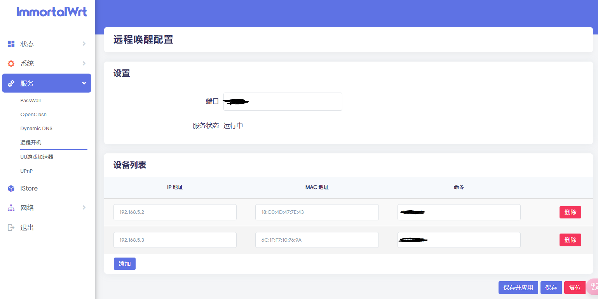
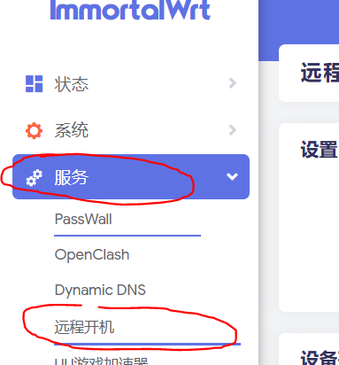
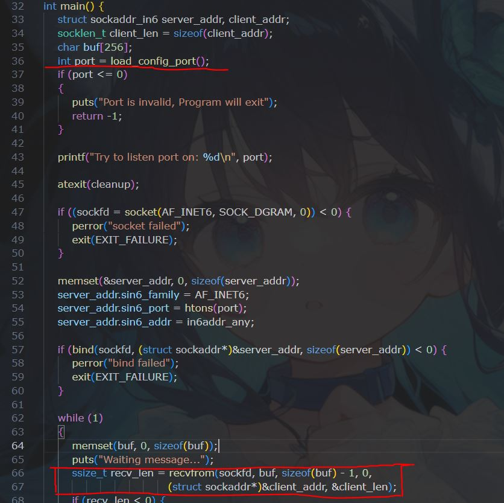
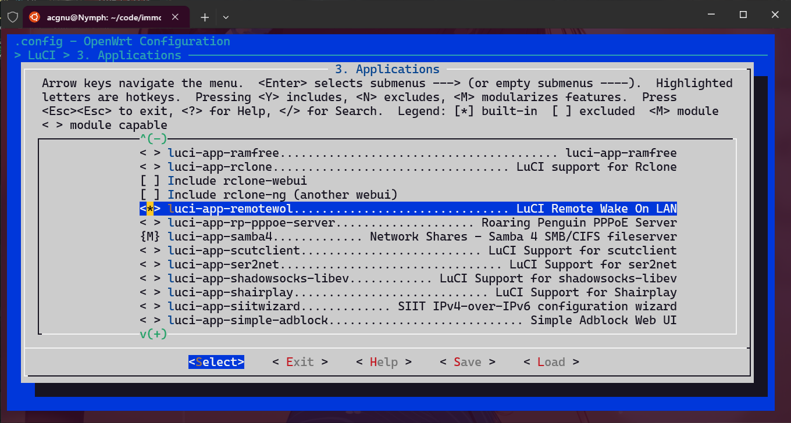

前言
---
最近更换了宽带, 拿到了公网IPv6, 刚好又换了一台 小米AX3000T 路由器, 搭载了 ARM 架构的 MT7981B 处理器, 使得安装 OpenWRT 成为了可能. 之前编写的[远程开机程序](../wol)是轮询模式的, 在拥有公网的现在, 本着折腾的心态, 就干脆改造成服务端监听模式, 顺便为其增加 UI 方便配置. 查阅资料后了解到可以使用 LuCI, 不过网上教程基本上是 UI 和 服务分离, 这需要分别编译两个软件包 (opkg), 而我其实希望只有一个软件包, 因此有了这篇文章

需求
---
编写带有 LuCI 的 OpenWRT 软件包 ( Package ), 包含 UI 和服务两部分, 作为服务运行并监听请求, 最终实现效果如下:



前置条件
---
* 公网 IPv6
* 域名 (可选)
* OpenWRT 或基于 OpenWRT 的分支系统, 本人安装的是 ImmortalWRT, 后文将只写 ImmortalWRT

开发准备
---
首先需要安装环境, 基于 OpenWRT 的软件包开发通常可以选择使用 SDK 或者完整的源码, 我这边由于是 ImmortalWRT 分支系统, 所以直接下载它的 **[源码](https://github.com/hanwckf/immortalwrt-mt798x)**
1. 按照源码仓库 **Requirements** 章节准备系统和开发工具, 我这里使用的WSL 20.04
2. 使用 `git clone` 源码, 我这里存放到目录 **/home/acgnu/code/immortalwrt-mt798x**
3. 参考源码仓库 **Quickstart** 章节执行以下步骤
    * 更新 feeds
    * 安装 feeds
    * 复制配置文件

    **注意这里不需要编译整个固件, 因此 `make` 是不需要执行的**
4. 在源码目录中执行 `PATH=/usr/local/sbin:/usr/local/bin:/usr/sbin:/usr/bin:/sbin:/bin make toolchain/compile -j$(nproc)`  编译工具链. 首次编译会生成 menuconfig, 此时不需要修改任何东西直接保存
> 使用WSL的任何 `make` 命令都需要加上`PATH`, 详见 [Build system setup WSL](https://openwrt.org/docs/guide-developer/toolchain/wsl)
    

编写程序
---

### 创建工程

在源码目录 **immortalwrt-mt798x/package/feeds/luci** 下新建工程目录 **luci-app-remotewol** 以及子目录, 此时完整的工程路径为 **/home/acgnu/code/immortalwrt-mt798x/luci-app-remotewol**

> 将工程文件存放在此目录是为了减少编译步骤, 由于固件源码中本身就包含 Luci 模块, 所以不需要其他额外操作. 如果按照 [OpenWRT 官方文档](https://openwrt.org/docs/guide-developer/start), 则还需要额外创建模块和链接操作

完整的工程目录如下, 关于每个目录的作用可以参考: [LuCI Modules](https://github.com/openwrt/luci/blob/master/docs/Modules.md)

```
luci-app-remotewol
    |--  luasrc
        |--  controller
            |--  remotewol.lua              #定义 LuCI 页面接口
        |--  model
            |--  cbi
                |--  remotewol.lua          #定义配置页面结构, 基于此结构生成页面组件
    |--  root
        |--  etc
            |--  config
                |--  remotewol                #定义服务需要用到的配置文件
            |--  init.d
                |--  remotewol                #定义 ImmortalWRT 后台服务规则
            |--  uci-defaults
                |--  luci-app-remotewol    #定义软件包安装时执行的脚本
        |--  usr
            |--  share
                |--  rpcd
                    |--  acl.d
                        |--  luci-app-remotewol.json    #定义 UCI 访问权限
    |--  src
          Makefile                                #定义此 src 目录中的源码编译
          remotewol.c                          #实际wol服务源码
    Makefile                                      #定义此软件包清单
```

### 编写 LuCI 前端

LuCI 前端的编写在网上有较多的教程和[Github源码示例](https://github.com/sirpdboy/sirpdboy-package/tree/main), 此处不再详细说明, 本项目源码已上传至[Github仓库](https://github.com/Acgnu/luci-app-remotewol), 简单介绍一下关键文件

* luasrc/controller/remotewol.lua 定义配置入口. 相关参考: [LuCI插件入门](https://juejin.cn/post/7343616758325035045), [开发OpenWrt路由器上LuCI的模块](https://www.cnblogs.com/weiweixu/p/4129234.html)
    ```
    #此处将此软件包注册在「服务」菜单, 模块为 remotewol, 名称为「远程开机」, 顺序 92
    entry({"admin","services","remotewol"},cbi("remotewol"), _("远程开机"), 92)
    ```
    效果图如下: 

    
* luasrc/model/cbi/remotewol.lua 定义配置项, LuCI 可根据配置项生成页面. 控件编写可参考: [Openwrt LuCI之CBI控件](https://www.cnblogs.com/lionxy/p/15269112.html)
* root/etc/config/remotewol 定义实际配置文件, 软件包安装时会按照 root 下的目录结构原样复制此文件到 OpenWRT 系统中, 本例会复制到 /etc/config/remotewol
* root/init.d/remotewol 通过继承 OpenWRT 系统脚本 /etc/rc.common 从而实现定义服务和执行逻辑, 而后可以在「系统」-「启动项」中呈现, 在脚本中实现 `start_service`, `stop_service`, `reload_service` 等函数即可从页面按钮中调用

    

* root/uci-defaults/luci-app-remotewol 软件包安装时自动执行的脚本, 这里主要需要给 root/init.d/remotewol 中的脚本文件赋予可执行权限和替换旧配置, 默认不可执行, 会导致服务脚本执行出错

### 编写 LuCI 服务端

因为这是基于 LuCI 的前端和服务端合并的软件包, 因此服务端源码有以下要求
* C 源码需要放在 src 目录中
* src 目录中需要包含 Makefile 以指示如何编译

C 源码编写没有特殊要求, 功能实现并非本文重点,  [src/remotewol.c](https://github.com/Acgnu/luci-app-remotewol/blob/master/src/remotewol.c) 内容大致为先读取 [/etc/config/remotewol](https://github.com/Acgnu/luci-app-remotewol/blob/master/root/etc/config/remotewol) 中的配置, 然后启动一个 IPv6 的 UDP 监听. 当收到来自客户端的启动命令时, 执行唤醒局域网内的设备.



而 src/Makefile 中的代码如下:

```
%.o: %.c
	$(CC) $(CPPFLAGS) $(CFLAGS) $(FPIC) -Wall -c -o $@ $<

clean:
	rm -f remotewol *.o

remotewol: remotewol.o
	$(CC) $(LDFLAGS) -o $@ $^ -ldl

compile: remotewol

install: compile
	mkdir -p $(DESTDIR)/usr/bin
	cp remotewol $(DESTDIR)/usr/bin/remotewol
```

基本上是模板代码, 主要提供编译, 清理, 安装. 一般只需要修改其中的程序名称和路径部分即可, 执行打包的时候会被调用.

编译和打包
---
**在源码根目录**, 首先执行 `PATH=/usr/local/sbin:/usr/local/bin:/usr/sbin:/usr/bin:/sbin:/bin make menuconfig` 进入构建配置菜单, 检查并确保 「LuCI」-「Application」中的 luci-app-remotewol 被选上, 如下图



保存后, 执行以下命令进行构建

`PATH=/usr/local/sbin:/usr/local/bin:/usr/sbin:/usr/bin:/sbin:/bin make package/feeds/luci/luci-app-remotewol/compile -j$(nproc)`

编译完成后, 将会在 immortalwrt-mt798x/bin/packages/aarch64_cortex-a53/luci 目录下生成 .ipk 文件, 即 ImmortalWRT 的软件包文件

> 编译时也可以执行 `PATH=/usr/local/sbin:/usr/local/bin:/usr/sbin:/usr/bin:/sbin:/bin make package/feeds/luci/luci-app-remotewol/{clean,compile} -j$(nproc)` , 这样可以在编译之前先清理 

安装和卸载软件包
---
安装就很简单了, 通过 `scp` 命令把 xxx.ipk 发送到路由器的任意目录, 然后执行 `opkg install xxx.ipk` 即可安装, 安装完成后就可以在「服务」菜单中看到了. 如果要卸载的话可以执行 `opkg remove xxx` 就可以连带配置文件和脚本一并删除了. 详细介绍请戳 [Package management with OPKG](https://wiki.8devices.com/openwrt:recipes:opkg)