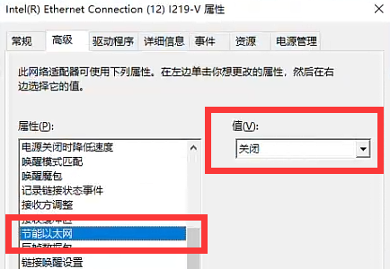
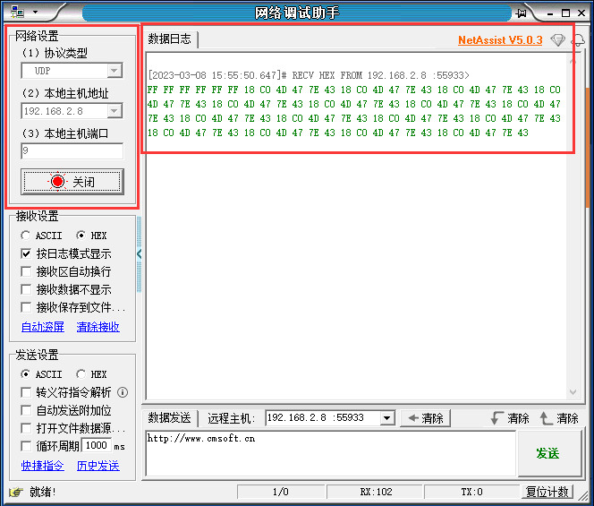
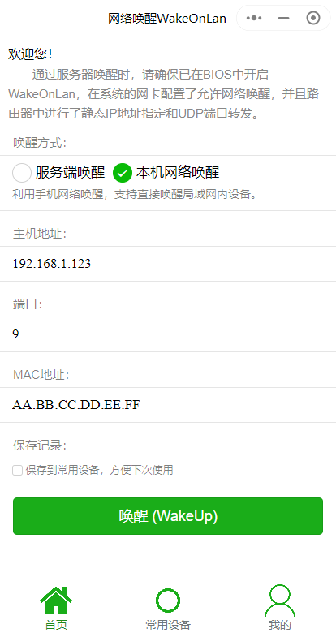
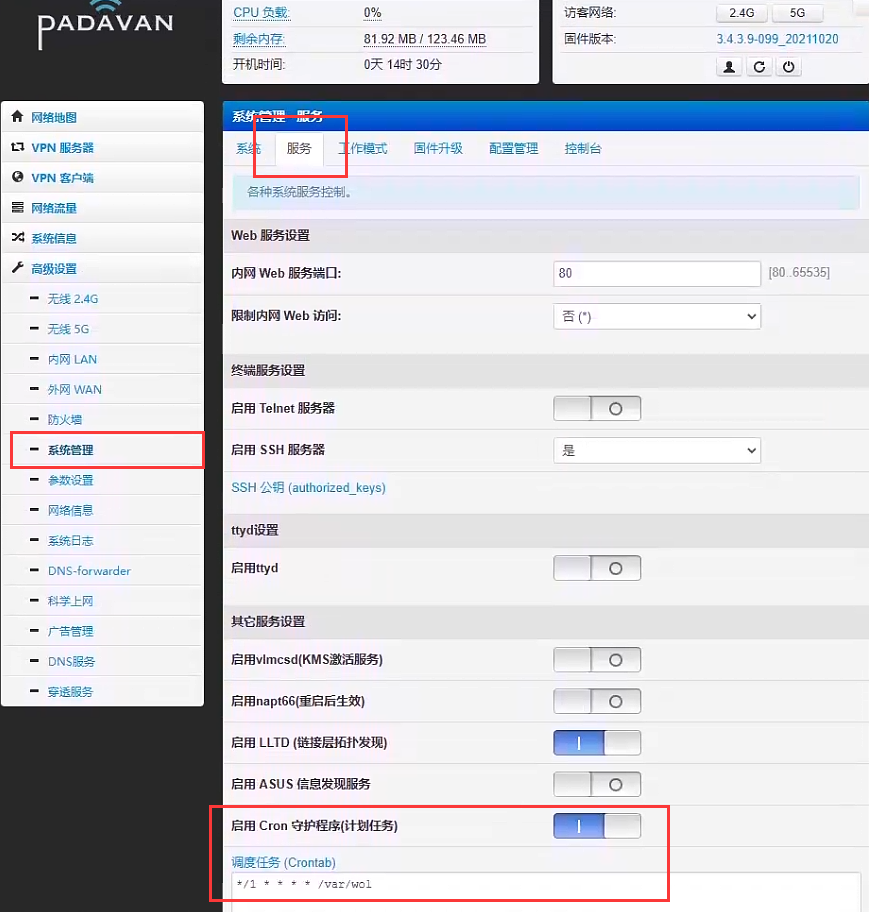
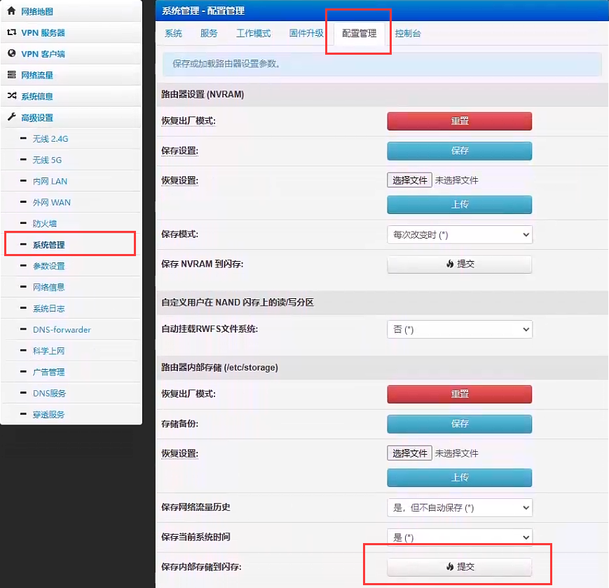
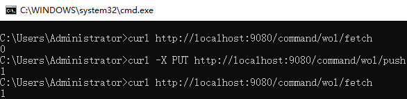

## 目录
1. [需求](#1)
2. [准备工作](#2)
3. [基本思路](#3)
4. [编写服务端](#4)
5. [编写客户端](#5)
6. [测试效果](#6)
7. [遇到的问题](#7)

<h2 id='1'>需求</h2>

由于有时需要远程家里的电脑所以是24小时待机的, 然而大部分时间其实都是用不上的, 后来发现家里电费居高不下跟电脑有很大的关系, 财库已空的我决定设置一套网络唤醒  

首先, 需要购买专用的唤醒设备例如网卡, 开关, 支持WOL的路由器之类的就不考虑了, 家里也没有多余的设备, 于是打算给路由器刷第三方系统之后由路由器来唤醒, 我的路由器是小米的AC2100, 刷了Padavan, 刷完后自带两个内网管理插件
- DDNS插件: 因为申请不到公网IP, 所以用不了
- Zerotier内网穿透插件: 配置后家里的网络连不上Zerotier服务, 查了一下说是被某些运营商屏蔽了(无语), 所以也用不了

虽然可以考虑刷支持其他内网穿透工具的固件, 但不想一个一个试, 且免费的内网穿透稳定性和速率通常都不太行, 最终决定自行编写一个WOL程序放到路由器执行

<h2 id='2'>准备工作</h2>

1. 一台支持运行三方程序的路由器, OpenWRT或Padavan等. 在路由器「DHCP」管理页中为需要唤醒的电脑设置**固定IP**以及「**ARP绑定**」
2. 电脑设置启用网络唤醒. [如何设置网络唤醒?](https://post.smzdm.com/p/a7d70m4g/) 以我的设备为例:  
主板「B460M AORUS ELITE (rev. 1.0) 」默认开启了网络唤醒, 无需修改任何设置.  
网卡「Intel(R) Ethernet Connection (12) I219-V」设置如下:
    - 关闭「以太网节能」, **可以解决关机时间过长后无法唤醒的问题**, 其他唤醒相关设置均已默认开启, 无需改动  
    
3. 测试效果. 反复关机测试并不方便, 我们可以下载[网络调试助手(NetAssist)](http://www.cmsoft.cn/resource/102.html)在开机状态下模拟接收
    - 协议类型选UDP
    - 本机主机地址填本机IP地址 (例: 192.168.1.123)
    - 端口填9, 因为魔术包是通过9端口收发的

    当收到数据包时就会展示在右侧
 
然后可以在手机上微信搜索小程序「网络唤醒WakeOnLan」, 确保手机与电脑出于同一个网络, 如下图所示**填写真实IP和MAC**
    
    点击「唤醒WakeUp」即可看到电脑收到数据包了, 收包没有问题后可以关闭电脑测试
4. 一台云服务器 (我这里用的是 [神秘哥们](https://bilib.cn) 的服务器, 再次感谢 [神秘哥们](https://bilib.cn) 的免费赞助)  
    > 没有云服务器? 也可以, 例如在代码托管网站上传一个文本文件, 编写的程序去请求这个文件并解析内容, 0代表不需要开机, 1代表需要. 需要开机的时候登录托管网站修改内容即可
5. 搭建开发环境. 我的路由器是MIPS架构处理器, 需要[搭建MIPS交叉编译环境](../mipsel), 其他架构自行查阅资料

<h2 id='3'>基本思路</h2>

由于开机需求对时效性要求并不高, 所以程序周期执行即可, 由以下三部分组成: 


1. **服务端**: 即云服务器上运行的HTTP服务, 提供两个接口
    - 接收命令: 接收来自控制端的命令
    - 查询命令: 提供查询最新的命令的接口给客户端
2. **客户端**: 运行在路由器上, 由crontab周期执行, 需要开机时唤醒电脑, Padavan可以在管理页面直接设置crontab, 如图所示, 填写 `*/1 * * * * /var/wol` 表示每隔一分钟执行 `/var` 目录下的「wol」程序

> 据说路由器重启后crontab会失效, 相关帖子: [关于padavan的crontab](https://www.right.com.cn/forum/thread-5763615-1-1.html), 如果不放心的话, 配置好crontab后在图示位置点击「提交」即可

3. **控制端**: 由于接收命令是HTTP接口, 所以控制端可以用任何实现, 本文不提供实现, 仅通过`curl`命令执行


<h2 id='4'>编写服务端</h2>

服务端业务简单, 综合开发速度和服务器资源采用Go语言开发, 新建**wol-server**项目, 添加main.go, 完整代码如下:
```
package main

import "fmt"
import "net/http"

var wol = 0

func main() {
	http.HandleFunc("/command/wol/push", PushCommand)
	http.HandleFunc("/command/wol/fetch", FetchCommand)
	http.ListenAndServe(":9080", nil)
}

func FetchCommand(w http.ResponseWriter, r *http.Request) {
	fmt.Fprintf(w, "%v", wol)
	wol = 0
}

func PushCommand(w http.ResponseWriter, r *http.Request) {
	if r.Method != http.MethodPut {
		http.Error(w, "0", http.StatusMethodNotAllowed)
		return
	}
	wol = 1
	fmt.Fprintf(w, "%v", wol)
}
```

代码很少简单说明一下
- 在9080端口开启HTTP服务, 暴露两个接口`/command/wol/push`和`/command/wol/fetch`, 分别对应实现`PushCommand`和`PushCommand`
- `PushCommand`将由控制端调用, 为避免在浏览器误操作限制了一下请求方式只能为PUT, 收到请求后会将开机标识`wol`设置为1
- `FetchCommand`将由路由器调用, 收到请求后会首先返回开机标识`wol`, 然后把`wol`再次设置为0, 避免重复触发

云服务器是Linux 64位系统, 而开发环境是Windows 64, 我们需要交叉编译为Liunx的可执行文件
1. 在PowerShell中执行`$Env:GOOS="linux"`命令将目标系统设置为Linux
2. 在开发工具终端中进入项目目录, 执行`go build`编译得到**wol-server**可执行文件

3. 复制**wol-server**到Linux中并执行`./wol-server`启动服务
4. 在CMD中执行命令`curl http://服务器IP:9080/command/wol/fetch`预览效果



参考资料: [GO的交叉编译](https://www.jianshu.com/p/1853a02cb440)

<h2 id='5'>编写路由器客户端</h2>

路由器容量和内存都很小, 所以客户端程序使用C来实现, 由于我刷入的Padavan系统支持`curl`命令, 所以网络请求的部分直接调用`curl`, 若想通过HTTP实现, 可以参考文章: [如何使用C语言实现HTTP请求](https://www.cnblogs.com/chorm590/p/c_http_get_201905081356.html)

创建CMake项目**wol-client**并添加源文件**wol.c**, 本文假设需要唤醒的电脑IP及MAC如下:  
**IP** 192.168.1.123  
**MAC** AA:BB:CC:DD:EE:FF


1. **使用`ping`命令检测电脑是否在线**  
因为程序每分钟会被执行一次, 我们可以通过函数`popen()`去调用`ping`命令来判断电脑是否在线, 当电脑在线的时候就没有必要从服务器查询开机命令了
```
FILE* file = popen("ping -c 1 -W 1 192.168.1.123 | grep -c \"100% packet loss\"", "r");
```
解释一下各项参数
- `-c` 表示ping的次数, 这里我们只ping一次
- `-W` 表示等待回复的超时时间, Linux上单位为秒, 这里设定成1秒, 因为局域网内在线的机器通常一秒内都能回复
- `gerp` 的 `-c` 表示只打印找到目标文本的行号, 这里我们使用`gerp`查找「100% packet loss」这段字符, 如果目标不在线, 那么行号会等于1, 反之行号等于0
> 提示: 也可以通过`system()`函数调用命令, 在命令中配合 `>` 将输出结果存入文本文件, 然后再读取文件内容即可 

2. **读取命令执行结果**
```
char cmd_value = getc(file);
pclose(file);
```
- `getc()`读取文件的第一个字符, 在上面`ping`命令中读取到的结果只会是0或1


3. **使用`curl`命令查询服务端数据, 同样将结果存入文件, 再次读取文件内容判断是否需要开机**
```
file = popen("curl http://服务器IP:9080/command/wol/fetch", "r");
```

4. **实现发送魔术包函数, 并通过UDP发送, 唤醒电脑**
```
/// <summary>
/// UDP方式发送魔术包
/// </summary>
/// <param name="mac">网卡的物理地址, 格式 XX:XX:XX:XX:XX:XX</param>
/// <param name="ip">局域网内的IP地址, 格式 XXX.XXX.XXX.XXX</param>
/// <returns></returns>
int send_magic_pack(const char* mac, const char* ip)
{
    int ret = -1;
    int send_length = -1;
    unsigned char packet[102] = { 0 };
    struct sockaddr_in addr;
    int sockfd, i, j, option_value = 1;
    unsigned char mactohex[6] = { 0 };

    sscanf(mac, "%02x:%02x:%02x:%02x:%02x:%02x",
        (unsigned int*)&mactohex[0],
        (unsigned int*)&mactohex[1],
        (unsigned int*)&mactohex[2],
        (unsigned int*)&mactohex[3],
        (unsigned int*)&mactohex[4],
        (unsigned int*)&mactohex[5]);

    //构建magic packet
    for (i = 0; i < 6; i++) { //6对“FF”前缀
        packet[i] = 0xFF;
    }
    for (i = 1; i < 17; i++) { //目标计算机的MAC地址，重复16次
        for (j = 0; j < 6; j++) {
            packet[i * 6 + j] = mactohex[j];
        }
    }

    //UDP
    sockfd = socket(AF_INET, SOCK_DGRAM, 0);
    //广播
    ret = setsockopt(sockfd, SOL_SOCKET, SO_BROADCAST, &option_value, sizeof(option_value));
    if (ret < 0) {
        //printf("set socket opt failed, errno=%d\n", errno);
        close(sockfd);
        return ret;
    }

    memset((void*)&addr, 0, sizeof(addr));
    addr.sin_family = AF_INET;
    addr.sin_port = htons(9);
    addr.sin_addr.s_addr = inet_addr(ip);//UDP广播地址

    //发送广播
    send_length = sendto(sockfd, packet, sizeof(packet), 0, (struct sockaddr*)&addr, sizeof(addr));
    close(sockfd);
    return ret;
}
```
之后在`mian()`函数中调用即可. 参考资料: [魔术包和C语言实现](https://blog.csdn.net/a18359388932/article/details/126949062)


其他部分完整代码如下
```
#include <stdio.h>
#include <stdlib.h>
#include <string.h>
#include <sys/socket.h>
#include <arpa/inet.h>
#include <unistd.h>

int send_magic_pack(const char* mac, const char* ip);

int main(int argc, char *argv[])
{
    //使用ping命令检测目标主机是否存在, -c 1 只ping一次, -W 1 超时时间1秒, gerp查找ping结果中100% packet loss字符, -c 只显示找到的行号
    FILE* file = popen("ping -c 1 -W 1 192.168.1.123 | grep -c \"100% packet loss\"", "r");
    char cmd_value = getc(file);
    pclose(file);
	if (cmd_value == '0')
	{
		puts("目标主机在线, 无需唤醒");
		return 0;
	}

    file = popen("curl http://服务器IP:9080/command/wol/fetch", "r");
    cmd_value = getc(file);
    pclose(file);
	if (cmd_value == '0')
	{
		puts("当前无开机命令");
		return 0;		//命令标记=0说明不需要开机
	}

	puts("收到开机命令, 执行开机...");
    int ret = send_magic_pack("AA:BB:CC:DD:EE:FF", "192.168.1.255");
    if (ret == 0)
        puts("唤醒包已发送");
	return 0;
}
```
> 注意: 函数`send_magic_pack()`目标IP参数可以是192.168.1.123, 但我这里传广播地址 192.168.1.255, 原因见后文

5. **编译**  
在Linux中导航到源文件所在目录, 执行命令`mipsel-linux-gnu-gcc wol.c -o wol -static`, 得到可执行文件**wol**
> 注意: 执行`mipsel-linux-gnu-gcc`命令需要先[搭建MIPS架构交叉编译环境](../mipsel)

<h2 id='6'>测试效果</h2>

全部编写好后, 将服务端发布到云服务器上并启动. 客户端可以通过WinSCP复制到路由器`/var`目录并配置好crontab (方法参考上文). 然后关闭电脑

此时用另一台电脑打开CMD, 输入`curl -X PUT http://服务器IP:9080/command/wol/push`, 正常的话就可以看到电脑在一分钟内启动了

如果此时没有另一台电脑, 也可以用手机打开终端(Android), 或者其他任意能够以PUT方式发送HTTP请求到服务器的也是一样的

<h2 id='7'>遇到的问题</h2>

**关机时间久了(大于1分钟)之后无法唤醒**  
可能的原因如下: 
1. 网卡没有禁用节能, 例如我的网卡需要关闭「以太网节能」, 参考上文. 另外我的路由器没有开启APR绑定, 在路由器管理页设置「APR绑定」或许也能解决
2. UDP发送的IP地址不对, 例如开始的时候发送包的目标IP是192.168.1.123, 刚关机可以唤醒, 但几分钟后就无法唤醒了, 后改成192.168.1.255后唤醒成功, 区别在于后者是广播地址, 关于广播的详细介绍可参考: [UDP广播](https://blog.csdn.net/weixin_47783699/article/details/127937448)

还有一个很奇怪的现象, 当时用自己编写的程序(以下简称WOL), 对比微信小程序「网络唤醒WakeOnLan」(以下简称小程序) 进行测试  

刚关机几分钟内, 通过小程序以及WOL都能够唤醒电脑. 当关机几分钟后, 使用小程序能够唤醒成功, 但是通过WOL就不能. 使用网络调试助手对比过两者发送的魔术包数据是完全一致的.  

后来将WOL发送的目标IP地址改成广播地址192.168.1.255之后就可以唤醒了, 但作为对比的小程序不论填192.168.1.123还是192.168.1.255还是255.255.255.255都可以唤醒, 推测可能还是因为没有设置「APR绑定」, 释放了IP, 而小程序有做特殊处理, 发送的也是广播IP