背景
---
作为一个家徒四壁的打工人, 在某鱼上购买二手的闲置商品便成了我实现梦想的捷径, 但某鱼经过多次升级改版已经相当流氓, 在我搜索出想要的商品的结果页, 嵌入识别度很低的广告, 导致我经常手滑点错, 然后直接跳转启动某宝, 某宝的启动速度又慢的令人发指, 最终还得按下多次返回才能再次回到某鱼的搜索结果页, 忍无可忍的我只能对它做一些不可描述的事了

目标
---
破解某鱼(版本: 6.7.40)并去除搜索结果页的广告, 同时去掉每次启动就弹窗的恼人的更新提示

某鱼的搜索结果页
---


> PS:一个屏幕总共就6个展位, 某鱼你这三个广告位良心不会痛吗

开始破解
---
首先尝试使用Android反编译大杀器[Jadx](https://github.com/skylot/jadx), 打开`Jadx`, 直接把某鱼安装包即`.apk`文件拖进去, 发现软件没有加壳, 可以看到`Jadx`顺利反编译出了某鱼的源码

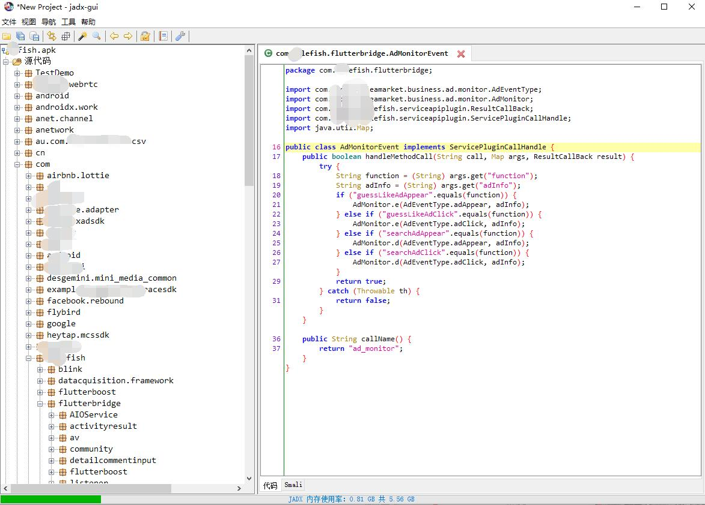

直接按 `Ctrl + S` 将源码全部保存, 然后导入`IDEA`, 开始分析代码

**首先从输入搜索目标后, 点击搜索的按钮开始入手**

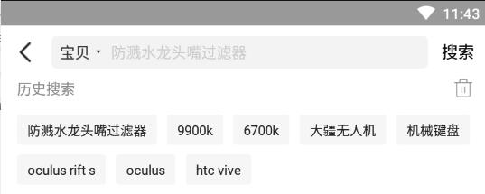

在代码中查找"搜索"关键字, 发现有多处匹配, 结合搜索面板底下的历史搜索布局, 推测该面板的布局文件应该是`search_mid.xml`

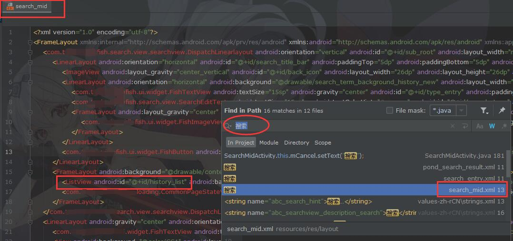

搜索布局文件引用的地方, 发现其在`SearchMidActivity`中被使用

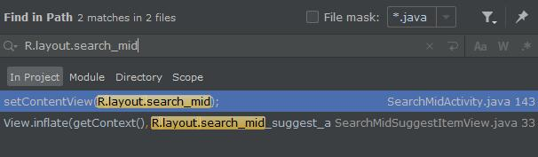

再查看布局文件代码, 搜索按钮的组件ID为`search_button`, 在`SearchMidActivity`中查找相关引用


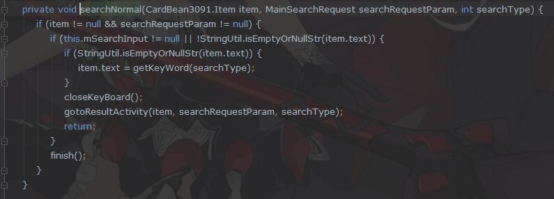

可以看出按钮点击后, 首先会调用`searchKeyAction`, 再经过层层调用最后到达`searchNormal`, 之后就会通过 `gotoResultActivity` 跳转到结果页, 继续跟踪`gotoResultActivity`方法


此处出现`searchresult`字符, 搜索这个字符

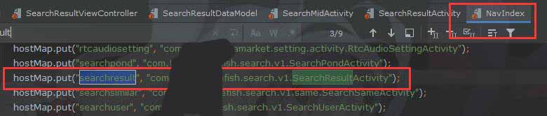

可以看出这个字符串对应的页面应该是 `SearchResultActivity`, 打开这个类之后一眼看不出什么重要的东西, 然后线索就这么中断了

线索中断之后, 可以用`Xposed`对某些可疑方法`Hook`, 然后通过打印调用堆栈的方法, 继续分析, 比如此我找到的`SearchResultInterrupter`中的`checkInterrupt`方法

> `Xposed`是一款`Android`底层的框架, 能够从虚拟机层拦截系统所有执行代码, 而`Xposed`模块是使用`Xposed`提供的`SDK`所开发的`Android`应用, 能够借助`Xposed`实现对所有关心代码的拦截, 详情请戳[Xposed官网](https://repo.xposed.info/)

```
Throwable ex = new Throwable();
StackTraceElement[] stackElements = ex.getStackTrace();
if (stackElements != null) {
    MyLog.log("调用堆栈:--------------------", true);
    for (int i = 0; i < stackElements.length; i++) {
    MyLog.log(stackElements[i].getClassName() + " -> " +
            stackElements[i].getMethodName() + "()"
        , true);
    }
}
```

不过这样比较麻烦而且也不好找. 于是换个思路, 安装`Xposed`模块[XAppDebug](https://github.com/Palatis/XAppDebug), 为某鱼强制开启`Debug`模式, 此时查看控制台会显示所有某鱼打印的日志信息, 现在控制台显示了包括网络请求在内的日志信息

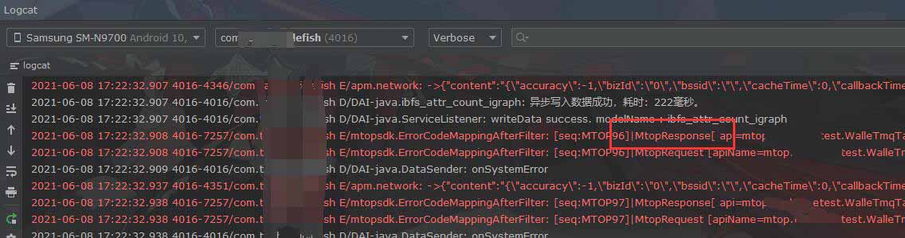

最终找到可疑类`MtopResponse`, 分析代码可以推测这个类应该是一个封装了网络响应的类, 其成员变量`bytedata`是主要数据源, `bytedata`将会被转换成`dataJsonObject`的`JSON`对象储存, 然后被使用, 因此找到`bytedata`赋值的方法`setBytedata`

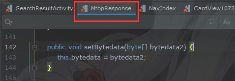

> 破解时间于2020年8月, 文章编辑时间为2021年6月, 我也不记得当初是不是这样找到`MtopResponse`类的, 没有记录下来是我的失误也是我的损失, 现在能找到这个类是因为当时开发`Xposed`模块中的代码有这一段. 如果某天我突然想起来了或者有兴致花时间重新找的话, 会回来补充的

使用`Xposed`拦截此函数, 并打印入参

```
findAndHookMethod("mtopsdk.mtop.domain.MtopResponse", loadPackageParam.classLoader,
        "setBytedata",
        byte[].class,
    new XC_MethodHook() {
        @Override
        protected void beforeHookedMethod(MethodHookParam param) throws Throwable {
            String content = new String((byte[]) param.args[0]);
            MyLog.log(content);
        }
    });
```

得到入参截取如下

```
"data": {
    "item": {
        ...
        "main": {
            "clickParam": {
                "arg1": "Item",
                "args": {
                    ...
                    "tagname": "全新\/极好\/298人想要",
                    "wantNum": "298",
                    "id": "619312410203",
                    "tag": "new\/credit-6\/wantnum-298",
                    "scm": "1007.32845.224895.0",
                    "publishTime": "1590461455000",
                    "i2i": "相似",
                    "search_tab_from": null,
                    "item_id": "619312410203",
                    "biz_type": "item",             //破解重点
                    "q": "10700k",
                    ...
                },
                "page": "Page_xySearchResult"
            },
            ...
        }
    }
    ...
}
...
```
此处截取了一条记录展示, 实际拦截到的参数中是一个数组, 包含本次结果页的所有商品, 其中就包括了搜索的商品, 广告商品, 推荐商品等, 通过对比发现, **搜索的商品数据在节点`args` > `biz_type` 的取值为 `item`, 而广告等商品取值为`ad`, `Bagtag`, `聚合卡片`**, 那么接下来要做的事就很明确了, **解析这个字符串, 如果发现是广告商品则从数据中删除这条数据**, 修改对`setBytedate`的`Hook`代码如下

```
...
protected void beforeHookedMethod(MethodHookParam param) throws Throwable {
    if (null == param.args[0] || ((byte[]) param.args[0]).length == 0) {
        return;
    }
    String content = new String((byte[]) param.args[0]);
    JSONObject jsonContent = new JSONObject(content);
    JSONObject jsonData = jsonContent.optJSONObject("data");
    if (null == jsonData || !jsonData.has("resultList")) {
        return;
    }
    JSONArray resultList = jsonData.getJSONArray("resultList");
    List<String> filterList = Arrays.asList("ad", "Bagtag", "聚合卡片");
    for (int i = 0; i < resultList.length(); i++) {
        JSONObject listItem = resultList.getJSONObject(i);
        String bizType = listItem.getJSONObject("data").getJSONObject("item")
            .getJSONObject("main").getJSONObject("clickParam").getJSONObject("args")
            .getString("biz_type");
        if (filterList.contains(bizType)) {
            if (Build.VERSION.SDK_INT >= Build.VERSION_CODES.KITKAT) {
                resultList.remove(i);
                i--;
            }
        }
    }
    param.args[0] = jsonContent.toString().getBytes();
}
...
```

上述代码首先将`byte`数组转换为`json`对象, 然后遍历所有商品, 将找到的广告商品移除, 再将处理过后的字符串重新转换为`byte`数组, 最后赋值给原始参数, 这样当某鱼实际代码`setBytedata`得到的参数将会是我修改后的参数. 编译验证后可以看到广告已经不会再显示了


禁用恼人的升级弹窗
---

**由于本人不爱更新, 且破解后如果更新版本, 可能导致破解失效, 所以必须禁用更新**

首先根据弹窗文字搜索代码


发现仅有一处, 位于`BaseUpgradeHandler`类的`onUpgradeNeed()`方法

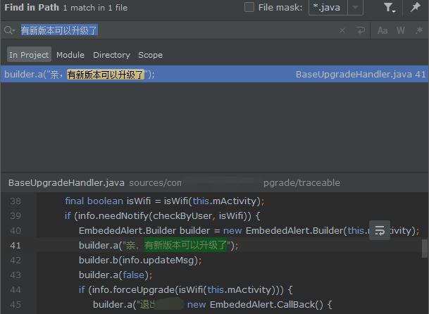

跟踪方法调用, 在`com.马赛克.马赛克fish.upgrade.traceable.Upgrade`类的`c`方法中被调用, 而`c`则被`b`调用

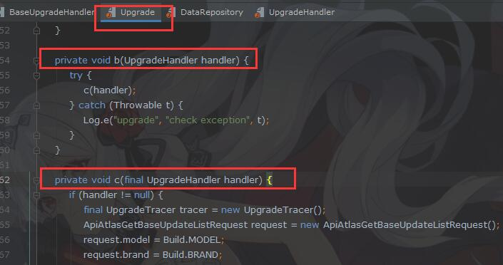

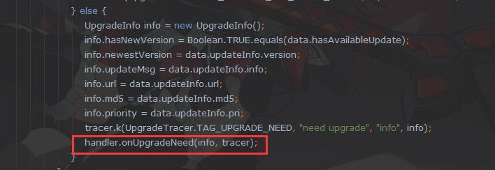

重点代码摘要如下:

```
private void c(final UpgradeHandler handler) {
    if (handler != null) {
        ...           
        handler.onUpgradeNeed(info, tracer);
        ...
    }
}
```

`c`中的代码的突破点在于, **如果传入的`handler`不为`null`, 才会执行更新检测并弹窗的方法**, 那么我只需要让传入的`handler`为`null`就可以了. 在`Xposed`模块中对`Upgrade`类的`b`方法`Hook`, 将入参设置为`null`

```
findAndHookMethod("com.马赛克.马赛克fish.upgrade.traceable.Upgrade",loadPackageParam.classLoader,
    "b",
    "com.马赛克.马赛克fish.upgrade.traceable.UpgradeHandler",
    new XC_MethodHook() {
        @Override
        protected void beforeHookedMethod(MethodHookParam param) throws Throwable {
            //这里将入参设置为null
            param.args[0] = null;
        }
    }
);
```

重新进行测试, **一切正常且启动之后不再有更新弹窗了**