## 背景

某抑云音乐随着版本更新, 加入了越来越多的垃圾功能和广告, 严重影响体验, 而且在歌单播放按钮上添加了购买VIP按钮, 不仅比播放按钮大, 还是延迟显示的, 非常容易误按, 就很生气, 于是决定干掉它们

## 目标

精简某易云UI, 只留下自己需要的部分, 同时各个地方的广告和更新提示

## 受害者版本

V7.2.10.782837

APP界面概览
--
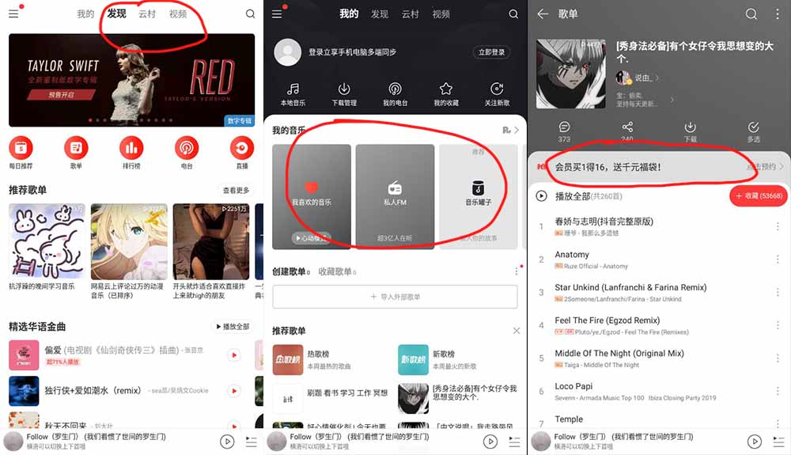

## 开始破解

直接用反编译工具[Jadx](https://github.com/skylot/jadx), 打开安装包即`.apk`, 发现软件没有加壳, 可以顺利反编译出源码, 直接按 `Ctrl + S` 将源码全部保存, 然后导入`IDEA`, 开始分析代码

> 虽然没有加壳, 但是经过了混淆, 阅读性非常差, 而且绝大部分字符串都经过了加密, 无法直接搜索, 可以说是非常猥琐了

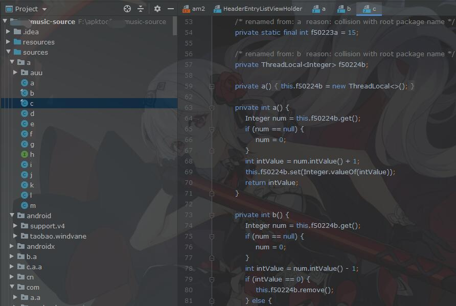

## 1.去除多余标签

首先去除本人用不上的标签页, 只需要留下"我的"标签页就行


首先全局搜索文字"我的"

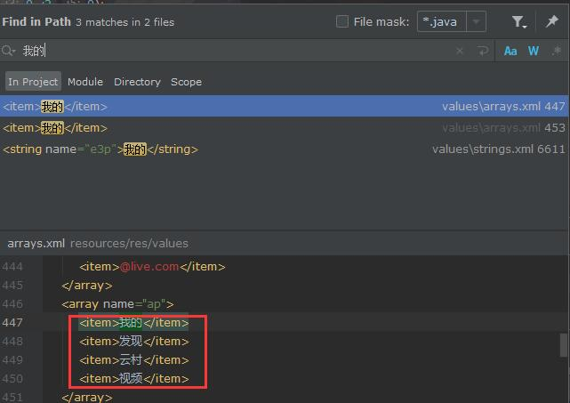

发现能够完全匹配标签栏四组文字的, 在一个`arrays.xml`文本里, 其中节点的`name`为`ap`, 于是搜索`R.array.ap`

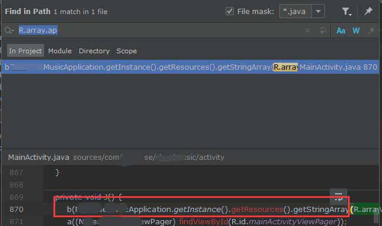

可以发现一处搜索结果, 位于`MainActivity`, 应该就是需要找的目标了, 看看这个`b`方法的实现

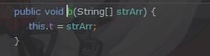

**发现此方法只是把`xml`里的数组保存, 那么我只需要把这个入参的值修改一下, 应该就可以实现去除多余标签的作用了**, 编写`xposed`模块代码如下

```
findAndHookMethod(
    "com.马赛克ease.马赛克music.activity.r", 
    loadPackageParam.classLoader, 
    "b",
    String[].class,
    new XC_MethodHook() {
        @Override
        protected void beforeHookedMethod(MethodHookParam param) throws Throwable {
            param.args[0] = new String[]{"我的"};
        }
    }
);
```

此代码将在`b`方法执行前执行, 将原本带有4个节点的数组重新赋值为只有一个的数组, 实际执行效果如下

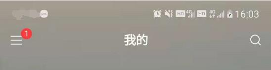

可以看到除了"我的"以外的标签, 其他的都已经不再显示了

## 2.去除用户VIP信息

用户VIP信息如下, 纯属占位置又无用的一块节点

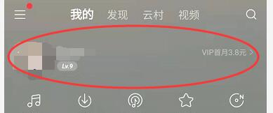

首先在[Android Device Monitor](https://developer.android.google.cn/studio/profile/monitor)查看一下VIP信息中头像节点的父节点`id`

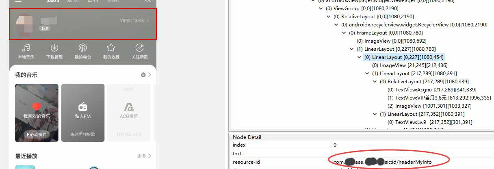

可以看到`id`为`headerMyInfo`, 在源码中全局搜索`headerMyInfo`, 找到`HeaderEntryListViewHolder`中有一处实际调用

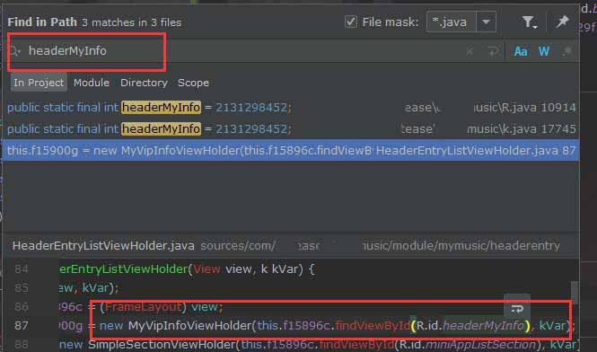

**此处将`headerMyInfo`的`view`传入`MyVipInfoViewHolder`作为参数, 之后创建了`MyVipInfoViewHolder`, 因此只需要修改一下传入的`headerMyInfo`布局参数, 即可隐藏这个节点**, 编写`xposed`代码如下:

```
findAndHookConstructor(
    "com.马赛克ease.马赛克music.module.mymusic.headerentry.MyVipInfoViewHolder", loadPackageParam.classLoader,
    View.class,
    "com.马赛克ease.马赛克music.module.mymusic.k",
    new XC_MethodHook() {
        @Override
        protected void afterHookedMethod(MethodHookParam param) throws Throwable {
            View view = (View) param.args[0];
            view.setVisibility(View.GONE);
        }
    }
)
```
此代码拦截`MyVipInfoViewHolder`的构造函数, 并将传入的参数`headerMyInfo`修改显示方式为`View.GONE`, 以达到隐藏的目的. 编写完后运行结果如下, 可以看到VIP节点已经成功隐藏

>注: 一个界面节点在创建之后可能会被多次调用, 直接删除节点可能会引起报错, 因为隐藏节点最为妥当


## 3.隐藏小程序标题以及小程序列表

此处小程序列表本人也是从来不用, 而其所占位置之大令人发指

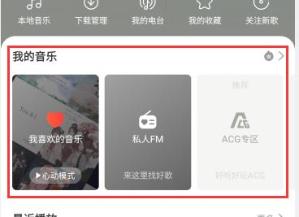

在[Android Device Monitor](https://developer.android.google.cn/studio/profile/monitor)中看到标题节点的父节点`id`为`miniAppListSection`

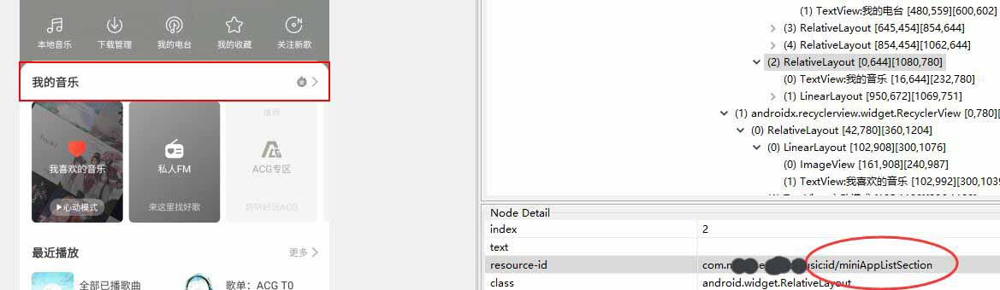

搜索这个`id`

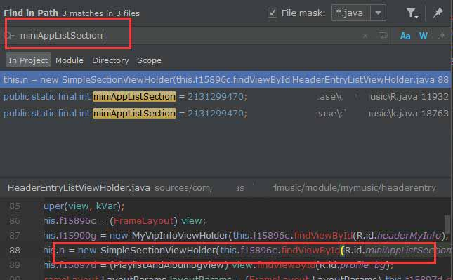

发现其在`SimpleSectionViewHolder`的构造函数中被调用, 该构造函数代码如下

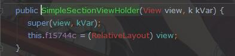

可以看出这里和刚才的VIP信息代码几乎一致, 因此可以采用刚才的方式进行隐藏, 但不同的是`SimpleSectionViewHolder`这个类有多处调用

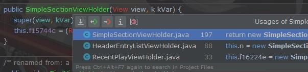

**为了保证我们隐藏的`view`参数是小程序的标题, 因此需要查看一下传入`miniAppListSection`节点的资源`id`**

>资源`id`是安卓应用在编译后对应每个节点生成的唯一`id`, 在编译期间可以使用`R.id`/`R.array`/`R.layout`等其实都是引用了这个`id`, 在编译后会生成在`R.java`中, 还有一个`public.xml`中存在一个同样的值与之对应

点击调用`SimpleSectionViewHolder`构造函数中参数`R.id.miniAppListSection`可以跳转到`R.java`, **此时看到的资源`id`为`2131299470`**

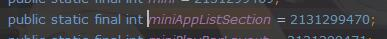

现在可以编写`xposed`代码如下

```
findAndHookConstructor(
    "com.马赛克ease.马赛克music.module.mymusic.SimpleSectionViewHolder", loadPackageParam.classLoader,
    View.class,
    "com.马赛克ease.马赛克music.module.mymusic.k",
    new XC_MethodHook() {
        @Override
        protected void afterHookedMethod(MethodHookParam param) throws Throwable {
            RelativeLayout layout = (RelativeLayout) param.args[0];
            if (layout.getId() == 2131299470) {
                layout.setVisibility(View.GONE);
            }
        }
    }
);
```

这里拦截`SimpleSectionViewHolder`的构造函数, 当资源节点的`id`为`2131299470`时, 将节点隐藏

继续寻找小程序卡片的布局, 这里卡片节点没有合适的节点`id`用于搜索, 因此找到他的父节点`id`为`myMusicRecyclerView`

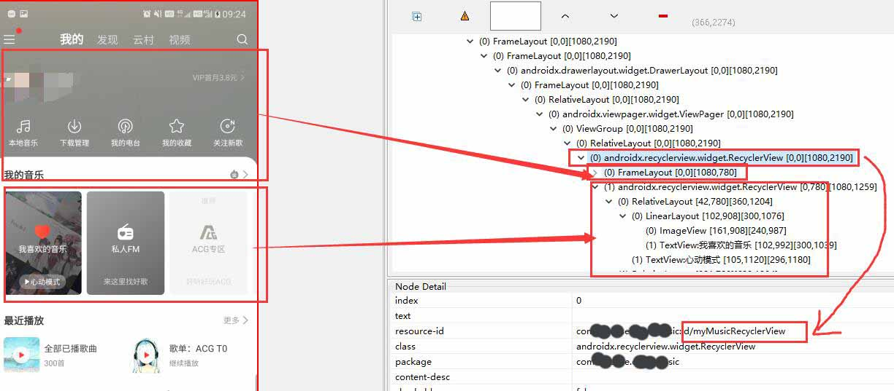

全局搜索`myMusicRecyclerView`, 得到多处结果, **但位于`com.马赛克ease.马赛克music.module.mymusic.k`中因为使用到了类`MiniAppListLinearViewHolder`, 根据名称推测`MiniAppListLinearViewHolder`应该是用于创建卡片父节点列表的**

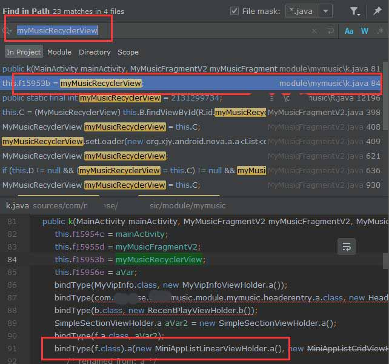

其中`bindType`调用了`MiniAppListLinearViewHolder.a()`, **跳转进去可以看到内部调用了构造函数**

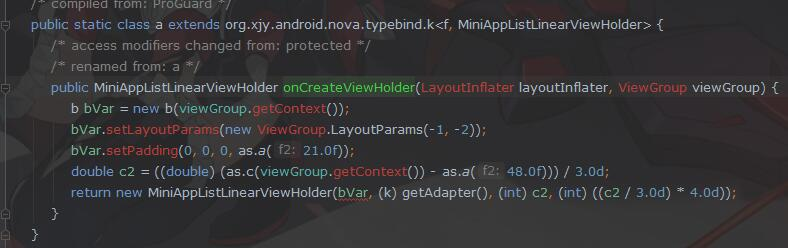

看一眼`MiniAppListLinearViewHolder`的构造函数代码

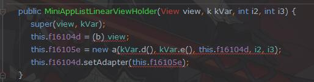

实现也非常简单, 推测可以使用刚才的方式将隐藏, 编写`xposed`代码如下:

```
findAndHookConstructor(
    "com.马赛克ease.马赛克music.module.mymusic.miniapp.linear.MiniAppListLinearViewHolder", loadPackageParam.classLoader,
    View.class,
    "com.马赛克ease.马赛克music.module.mymusic.k",
    int.class,
    int.class,
    new XC_MethodHook() {
        @Override
        protected void afterHookedMethod(MethodHookParam param) throws Throwable {
            View miniAppListView = (View) param.args[0];
            ViewGroup.LayoutParams layoutParams = miniAppListView.getLayoutParams();
            layoutParams.height = 0;
        }
    }
);
```
这里拦截`MiniAppListLinearViewHolder`的构造函数, 并将布局高度改为0, 达到隐藏的目的, 运行效果如下


在隐藏了这么多节点之后, 布局出现了一点问题

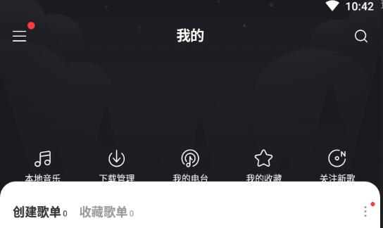

可以看到"本地音乐"这一栏的按钮偏下了, 需要调整一下位置. 首先查看一下这一栏按钮父节点`id`

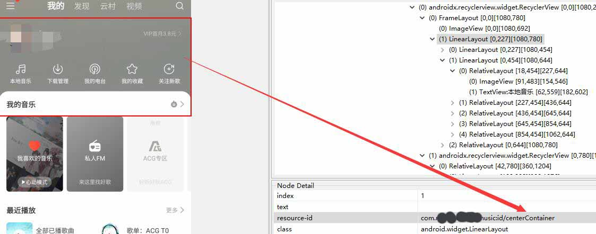

可以看到父节点`id`为`centerContainer`, 全局搜索后可以找到一处调用

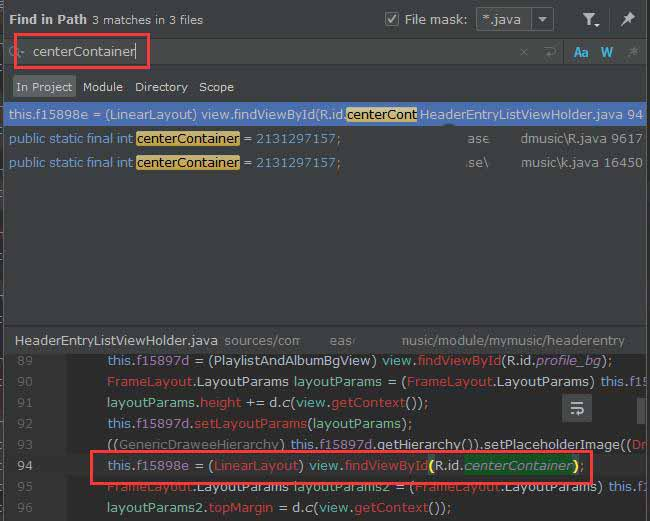

**这个节点被赋值为成员变量`f15898e`, 而这个变量名是由反编译工具改名而来, 可以看到反编译提示原本变量名为`e`**

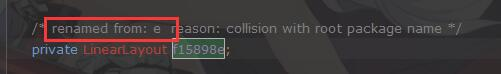

下面需要修改这个节点的布局参数, 编写`xposed`代码如下

```
findAndHookConstructor(
    "com.马赛克ease.马赛克music.module.mymusic.headerentry.HeaderEntryListViewHolder", loadPackageParam.classLoader,
    View.class,
    "com.马赛克ease.马赛克music.module.mymusic.k",
    new XC_MethodHook() {
        @Override
        protected void afterHookedMethod(MethodHookParam param) throws Throwable {
            LinearLayout view = (LinearLayout) getObjectField(param.thisObject, "e");
            FrameLayout.LayoutParams layoutParams = (FrameLayout.LayoutParams) view.getLayoutParams();
            layoutParams.bottomMargin = 50;
            layoutParams.gravity = Gravity.BOTTOM;
        }
    }
);
```

此处拦截赋值部分的方法, 在`HeaderEntryListViewHolder`的构造方法执行之后, 获取到成员变量`e`并修改其布局为`Gravity.BOTTOM`, 将节点靠底排列, `bottomMargin=50`, 距离底部50个边距, 编译后运行效果如下


可以看到按钮正常排列了

>按钮上方留白一段距离主要是为了设置背景的时候可以看到

至此, 首页全部整改完毕, 完整效果图如下


## 4.去除播放列表顶部广告按钮

这个该死的广告按钮和播放按钮放一块非常容易误触

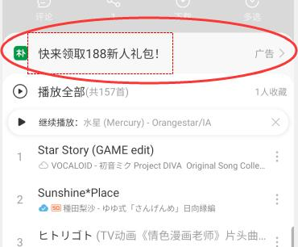

首先查看节点`id`, 得到`exposureGuideIcon`

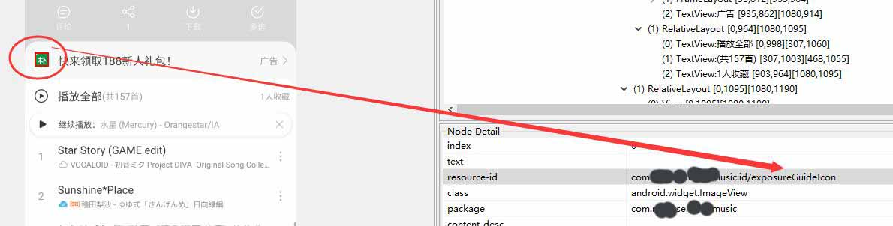

全局搜索, 发现在构造函数中有一处引用

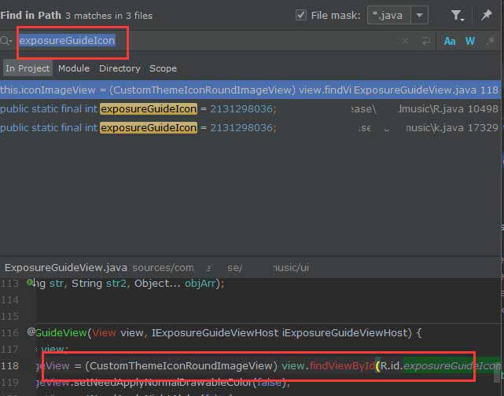

通过搜索`new ExposureGuideView`查看实例被创建的地方, 找到两处, 但当前界面是播放列表, 因此关注`PlayListFragment`

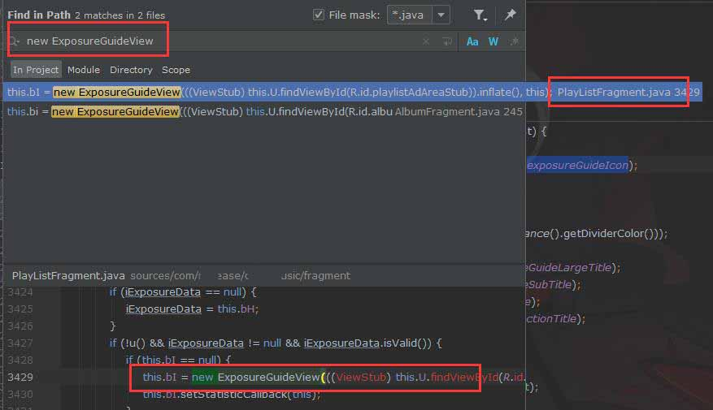

实例在`PlayListFragment`的`cl`方法中被创建, 查看一下`cl`的完整代码

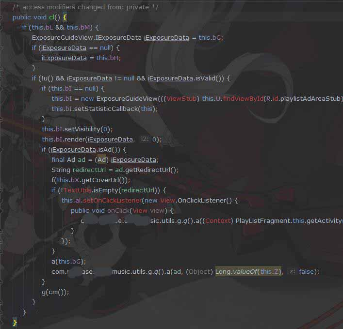

初步分析基本上都是干的和广告相关的事, 因此直接拦截取缔这个方法, 编写`xposed`代码如下

```
findAndHookMethod(
    "com.马赛克ease.马赛克music.fragment.PlayListFragment", 
    loadPackageParam.classLoader, 
    "cl", 
    new XC_MethodReplacement() {
        @Override
        protected Object replaceHookedMethod(MethodHookParam methodHookParam) throws Throwable {
            return null;
        }
    }
);
```

此处代码直接替换原有方法执行, 不做任何事, 之后运行效果如下


可以看到广告已经被移除了

## 5.去除开屏广告

开屏广告非常烦人, 且严重影响启动速度, 必须移除

>以下修改均为2019年期间, 我也不记得当时具体是怎么找的了, 只能以现有结果大致推测

首先从启动类入手, 查看`AndroidManifest.xml`, 找到`intent-filter`为`android.intent.category.LAUNCHER`的一项`Actvity`即为启动类, 这里为`LoadingActivity`

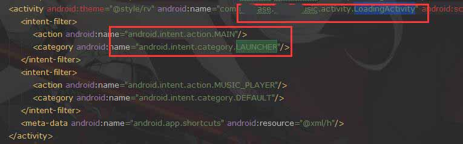

查阅`LoadingActivity`的代码, 会发现其重写了`onActivityResult`

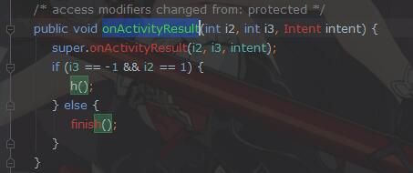

接着深入查看一下`h`方法

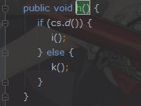

再看看`i`方法

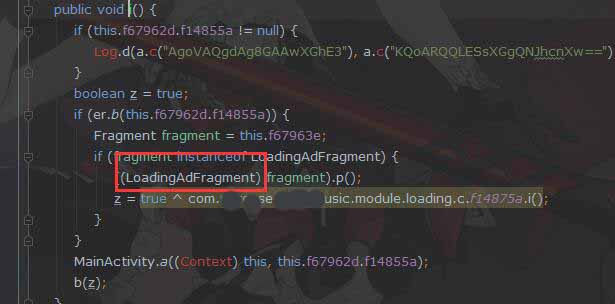

**这里出现了一个关键的类 `LoadingAdFragment`, 看名字就像是一个读取广告的, 点进去查看一下类的代码可以看到, 在`onCreate`的时候从`Bundle`里尝试读取`AdInfo`**, 这越看越像广告

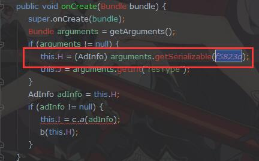

那么看一下取的`key`名称, 也就是变量`f5823d`的值

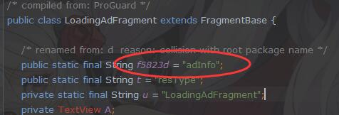

**可以看到这个键的名称也是叫做`adInfo`, 那么根据`onCreate`里的代码来看,如果取不到`adInfo`, 那应该就不会展示广告了吧**, 而`arguments`参数是从`getArguments()`方法中获取的, 点进去看一下这个方法的实现

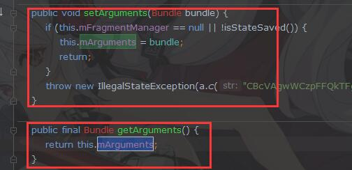

可以看到`getArguments()`只是返回了`this.mArguments`, 而`this.mArguments`是从`setArguments(Bundle bundle)`赋值的, **那我只要拦截赋值方法将`adInfo`这个广告过滤掉就可以了**

 于是编写`xposed`代码如下

```
findAndHookMethod(
    "androidx.fragment.app.Fragment", 
    loadPackageParam.classLoader, 
    "setArguments",
    Bundle.class, 
    new XC_MethodHook() {
        @Override
        protected void beforeHookedMethod(MethodHookParam param) throws Throwable {
            Bundle arg = (Bundle) param.args[0];
            if (arg == null || !arg.containsKey("adInfo")) {
                return;
            }
            arg.putSerializable("adInfo", null);
        }
    }
);
```
这里拦截了`setArguments`, 判断传入的参数是否包含键为`adInfo`的参数, 如果有的话, 把这个`bundle`设置为`null`

但这并不完美, 因为只是隐藏了广告, 请求广告的代码任然会执行, 浪费资源, 因此继续深入追踪代码, 再经过一番我也不记得当时怎么找到现在也因为很复杂懒得找的寻找之后, 最终确定到`com.马赛克ease.马赛克music.module.ad.a.a`类中的`a(int, string)`是实际执行请求广告的代码, 如下:

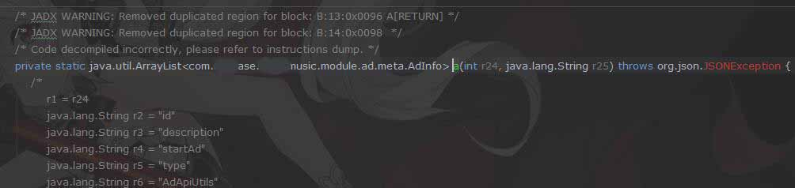

这一部分代码无法反编译出来, 但问题不大, 反正不需要执行这部分代码, 直接编写`xposed`代码如下

```
findAndHookMethod(
    "com.马赛克ease.马赛克music.module.ad.a", 
    loadPackageParam.classLoader, 
    "a",
    int.class,
    String.class,
    new XC_MethodReplacement() {
        @Override
        protected Object replaceHookedMethod(MethodHookParam methodHookParam) throws Throwable {
            return null;
        }
    }
);
```

直接拦截并替换掉目标方法, 不做任何事情, 这样一来就不会再请求广告了, 编译后运行发现进入速度变快了也没有烦人的开屏广告了

## 6.去除更新检查

更新弹窗非常烦人, 必须干掉. 首先一般更新检查都是调用的同一个地方的代码, 直接来到APP的"关于"界面, 找到更新检查按钮, 通过[Android Device Monitor](https://developer.android.google.cn/studio/profile/monitor)可以看到更新按钮的`id`为`updateVersionArea`

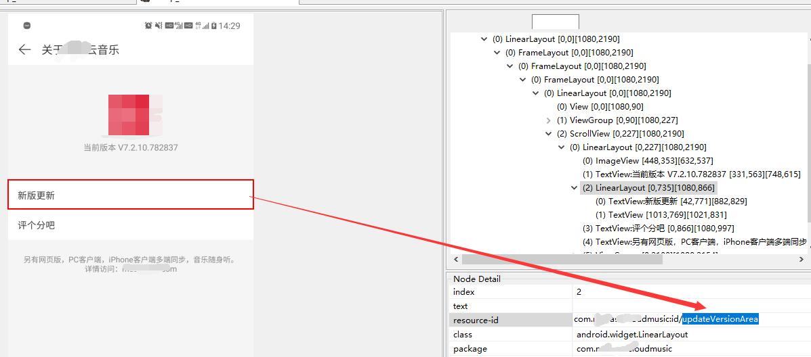

全局搜索这个`id`, 在`setOnClickListener`处有调用

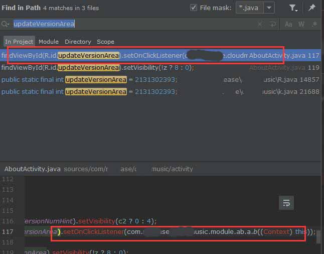

这里直接通过调用方法传入了参数, 一路跟踪这个方法, 都是比较简单的调用, 这里的分支查看`super.a(z)`的代码

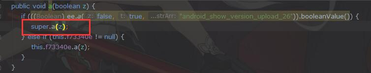

最终会来到`com.马赛克ease.马赛克music.appupdate.a.a`类, 看这个包名推测确实没找错地方, 而最终调用的`a(boolean)`应该就是检查更新的核心代码

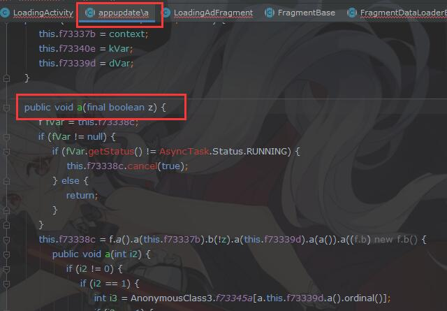

不多说直接编写`xposed`代码进行拦截, 代码如下

```
findAndHookMethod(
    "com.马赛克ease.马赛克music.appupdate.a", 
    loadPackageParam.classLoader, 
    "a",
    boolean.class,
    new XC_MethodReplacement() {
        @Override
        protected Object replaceHookedMethod(MethodHookParam methodHookParam) throws Throwable {
            return null;
        }
    }
);
```

直接将拦截目标方法替换掉, 不执行任何业务, 编译后再次打开APP会发现已经去除了更新检查, 至此, 所有该整改都已经完成

## 附录

---

+ *由于这APP将所有字符串加密, 因此很多节点无法直接通过文本搜索, **经发现其解密部分的代码位于`a.auu.a`的`c(string)`方法**, 可以通过`xposed`拦截前后参数来获得解密前和解密后的数据, 代码如下*

```
findAndHookMethod(
    "a.auu.a", loadPackageParam.classLoader, 
    "c", 
    String.class,  
    new XC_MethodHook() {
        @Override
        protected void beforeHookedMethod(MethodHookParam param) throws Throwable {
            strBeforeDec = param.args[0];
        }

        @Override
        protected void afterHookedMethod(MethodHookParam param) throws Throwable {
            MyLog.log(strBeforeDec.toString(), param.getResult().toString(), doLog);
        }
    }
);
```

该代码先拦截入参, 把参数记录一下, 在解密方法执行完之后打印入参和出参, 除此之外, 也可以使用`xposed`去主动调用解密方法, 代码如下

```
Class[] argCls = new Class[]{String.class};
Object result = callStaticMethod(findClass("a.auu.a", loadPackageParam.classLoader), "c", argCls, "待解密");
```

+ *拦截存储目录*

可以通过以下代码拦截APP能够获取到的储存目录

```
findAndHookMethod(
    "com.马赛克ease.马赛克music.utils.马赛克easeMusicUtils", 
    loadPackageParam.classLoader, 
    "c", 
    boolean.class, 
    new XC_MethodHook() {
        @Override
        protected void afterHookedMethod(MethodHookParam param) throws Throwable {
        }

        @Override
        protected void beforeHookedMethod(MethodHookParam param) throws Throwable {
        }
    }
);
```

`马赛克easeMusicUtils`工具类包含读取内置存储目录的方法, 可以在这里拦截并修改对应参数使得APP读取指定的目录

>当初是因为APP总是读取到我音乐文件夹以外的文件夹, APP自带的过滤器又没有效果, 只能我自己改了

## 结语

不得不说这混淆确实增加了很多麻烦, 尤其是当初找广告代码的时候, 不过随着经验的增加现在找起来比以前快了很多, 另外国产APP真就一个比一个流氓, 越更新越是增加乱七八糟的功能, 因为可以同步歌单才一直没卸载, 但随着版权越抓越紧, 它已经越来越不好用了, 现在移动端已经卸载换了一个纯粹的本地播放器, 希望PC端能够保持初心吧


