背景
---
由于某些需要, 进入某大楼的时候必须用他们物业指定的APP刷门禁, 我安装的时候是6.5.0版本, 这会儿启动速度也还可以, 也没太多花里胡哨的功能. 然而没过多久就迎来了一波强制版本更新, 更新后的版本启动速度慢到令人发指, 且增加了商城, 我就怒了, 区区门禁软件竟然这样肆意妄为, 开工!

目标
---
破解某加(版本: 6.5.0)去除更新检查, 去掉实名认证

> 某加在7.0.0版本更名为某品, 破解版本为6.5.0, 在此保持称呼其为某加

某加APP(版本6.5.0)界面


开始破解
---
首先尝试使用Android反编译大杀器[Jadx](https://github.com/skylot/jadx), 打开`Jadx`, 直接把某加安装包即`.apk`文件拖进去, 发现软件没有加壳, 可以看到`Jadx`顺利反编译出了某加的源码

> 7.0版本开始APP加了壳, 没记错的话是某数字安全软件的壳, 脱壳过于麻烦于是使用6.5.0版本破解

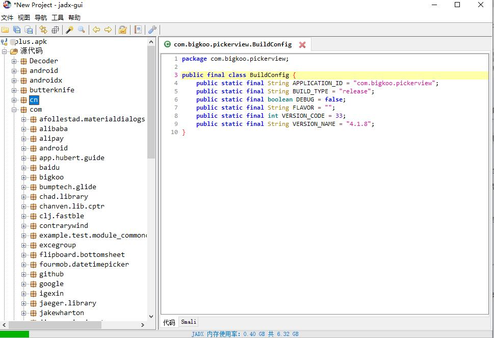

直接按 `Ctrl + S` 将源码全部保存, 然后导入`IDEA`, 开始分析代码

禁用强制升级
---

首先根据弹窗文字"发现新版本"搜索代码

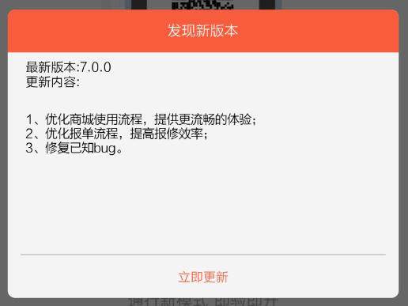

发现全文匹配的仅有一处, 位于布局文件`dialog_check_update.xml`

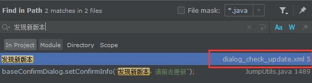

查找使用该布局文件的地方, 仅有一个类`UpdateNoticeDialog`

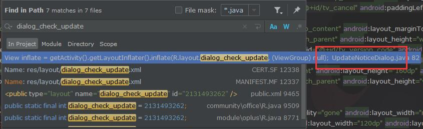

查看`UpdateNoticeDialog`的代码, 可以看出这是一个自定义的对话框, 和APP显示的更新弹出框一致

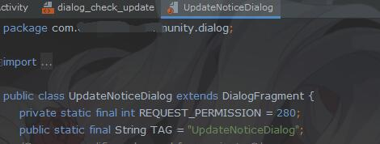

接着查找使用到了`UpdateNoticeDialog`类的地方, 发现多处引用

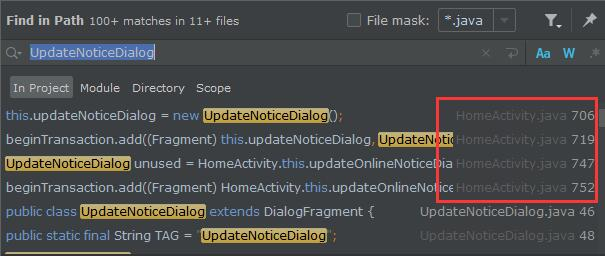

而APP弹出更新提示的时候, 我正位于APP的首页, 可以推断出`HomeActivity`应该就是我要寻找的弹框处, 查看`HomeActivity`的代码如下

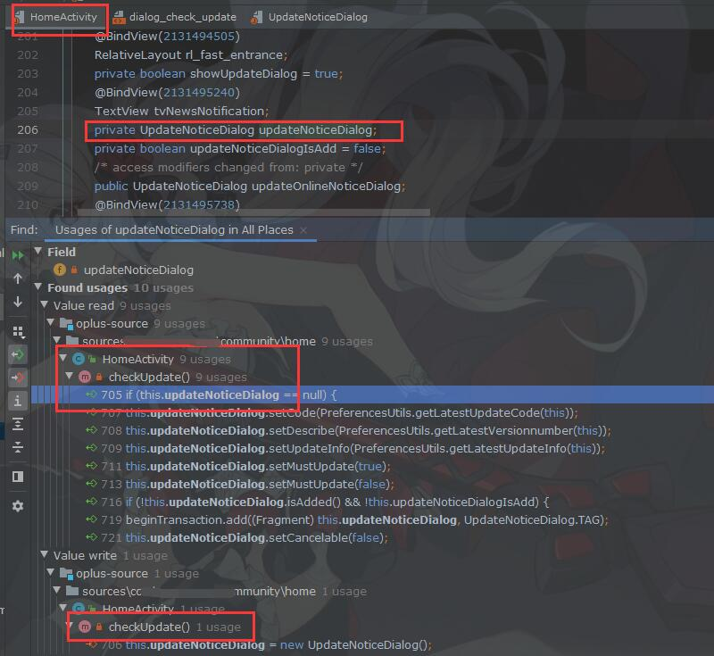

可以看到这里将`UpdateNoticeDialog`定义为成员变量, 然后在`checkUpdate`中对`UpdateNoticeDialog`赋值, 且其他操作都位于`checkUpdate`中, 现在看看`checkUpdate`完整代码如下

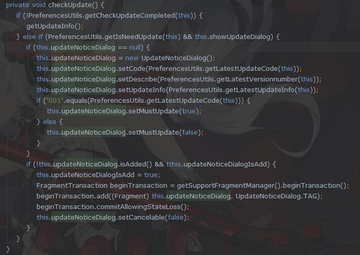

这个方法并没有做除了更新检查以外的事, 那么我只需要在`Xposed`中替换这个方法就可以了, 这样当APP调用`checkUpdate`时, 将执行我定义的方法, `Xposed`模块代码如下

```
findAndHookMethod("com.马赛克.马赛克.home.HomeActivity", loadPackageParam.classLoader,
    "checkUpdate",
    new XC_MethodReplacement() {
        @Override
        protected Object replaceHookedMethod(MethodHookParam param) throws Throwable {
            return null;
        }
    });
```

这里直接使用`replaceHookedMethod`, 用自己定义的方法代替`checkUpdate`执行, **写好后重新运行可以发现首页更新弹窗已经被屏蔽了.**

然而后来手贱不小心退出登录了, 再启动APP时发现登录的时候也有更新认证, 现在可行的方法有二, 一是找到登录界面, 用同样的方法去除更新, 但是这样一来繁琐, 二来他可能还有其他的地方有更新检查, 所以使用第二种方法

根据Android开发文档可以得知, **可以在APP的`AndroidManifest.xml`中可以定义当前APP的版本号, 然后可以在`Java`代码中使用`PackageInfo`来获得当前APP的版本信息, 而定义版本主要分为版本号`versionCode`和版本名`versionName`, 一般使用`versionCode`大小来判断是否需要更新, 而`versionName`则主要用作展示**, 查看某加APP的`AndroidManifest.xml`文件, 发现其版本定义如下

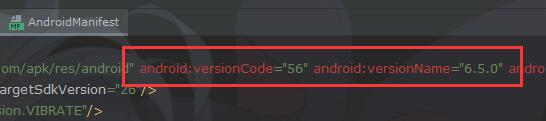

那么一般的做法只要将`versionCode`的值修改成足够大, 就能达到免更新的目的, 但是实际操作下来发现这APP比较鸡贼, 判断版本是否更新并不是简单通过`versionCode`大小来判断, 不过当时为了偷懒也没有进一步分析版本检查代码, 我只知道最新版本的`versionName`是7.0.0, 所以直接使用`Xposed`将返回的`versionName`修改为固定的7.0.0

```
findAndHookMethod("android.app.ApplicationPackageManager", loadPackageParam.classLoader,
    "getPackageInfo",
    String.class,
    int.class,
    new XC_MethodHook() {
        @Override
        protected void afterHookedMethod(MethodHookParam param) throws Throwable {
        PackageInfo packageInfo = (PackageInfo) param.getResult();
        if (null != packageInfo && getTargetPackage().equals(packageInfo.packageName)) {
                packageInfo.versionCode = Integer.MAX_VALUE;
                packageInfo.versionName = "7.0.0";
            }
        }
    });
```
此处使用`Xposed`直接`Hook` Android系统的包管理器, 当某加需要获取版本名时, 直接返回7.0.0, 不过这样做的缺点是如果某加未来版本更新到7.0.0以上时, 需要修改代码, 然而从2020年12月破解至今, 某加都没有再发布过版本更新, 省了我不少事

**至此重新打包运行, 发现登录的更新检查也被去除了**

然而新的风暴又出现了, 由于刚才的不慎退出, 现在需要重新上传实名认证资料了, 包括身份证号和照片, 由于我之前已经填过一次, 而且上传后需要重新审核, 所以不愿意再次填写, 于是开始寻找认证部分的代码

跳过实名认证
---

认证弹窗如下

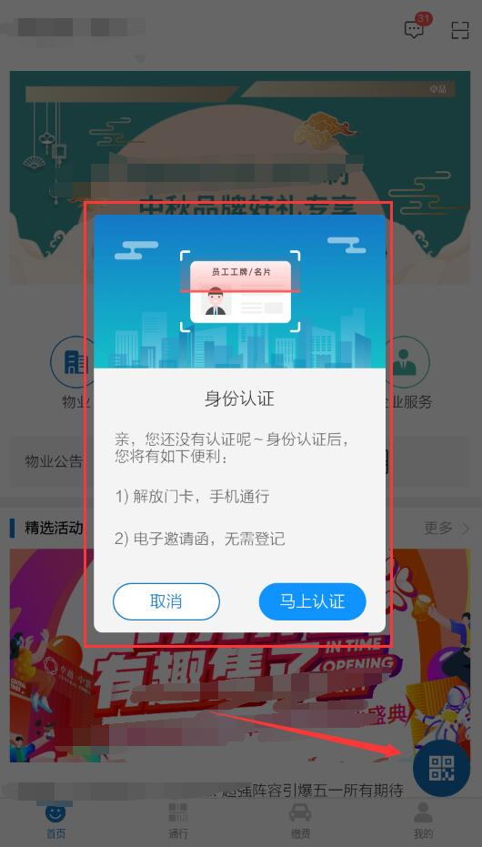

当我点击右下角的显示门禁卡二维码按钮的时候, 就会弹出认证弹窗, 我们知道`Activity`会通过`setContentView`加载一个布局文件, 此页面为APP首页, 所以在`HomeActivity`中搜索`setContentView`, 发现并没有结果

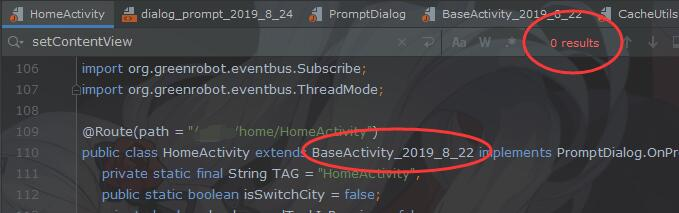

但是`HomeActivity`继承自`BaseActivity_2019_8_22`, 于是在父类中找到了`setContentView`

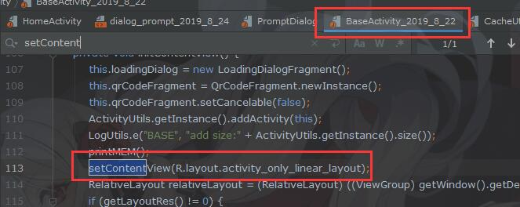

可以看到这里加载的布局是`activity_only_linear_layout.xml`, 查看这个布局文件, 里面的代码非常简单

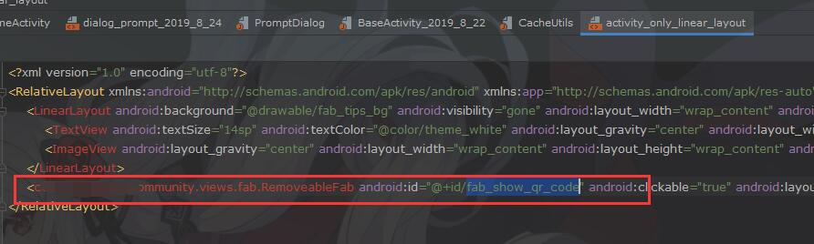

根据名称可以很容易的推断出id为`fab_show_qr_code`的按钮组件就是首页显示二维码的组件, 搜索这个id查看他的点击事件

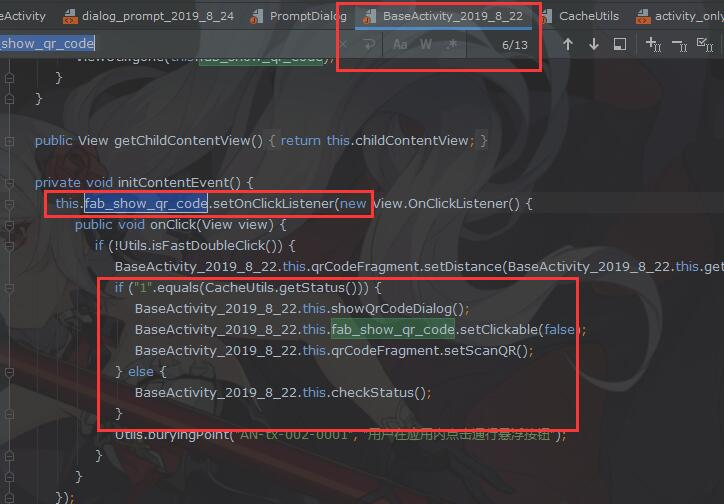

根据判断逻辑, 如果`CacheUtils.getStatus()`返回为1, 就展示二维码弹窗, 不为1则执行`checkStatus()`, 以防万一, 看看`checkStatus()`的代码如下

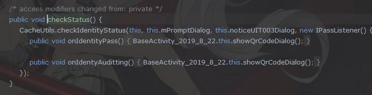

显然`checkIdentityStatus()`这名字就很直白的告诉我这个就是用来检查身份认证的了, 在回来看看`CacheUtils.getStatus()`代码如下

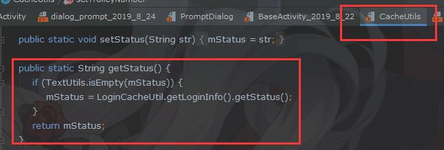

这里的逻辑也很简单, 就是从登录信息中获取认证状态, 那么我只要用`Xposed`将`getStatus()`的返回值修改为1就可以了, `Xposed`代码如下

```
findAndHookMethod("com.excegroup.community.utils.CacheUtils", loadPackageParam.classLoader, "getStatus",
    String.class,
    new XC_MethodHook() {
        @Override
        protected void afterHookedMethod(MethodHookParam param) throws Throwable {
            param.setResult("1");
        }
    });
```

`Hook`代码将在`getStatus()`执行之后执行, 将其返回值为修改为1, 现在重新运行, **程序一切正常, 也没有身份认证弹窗了, 点击显示二维码按钮正常显示门禁二维码**

