背景
---
由于个人喜好, 比较喜欢直角屏的手机, 但市面上的手机放眼望去只有三星Note系列符合我的爱好, 遂购买三星Note 10御用, 然而这手机虽然造型是方方正正的, 但是UI却跟S系列一样到处都是圆角, 这让我很不舒服, 于是有了此文章

目标
---
将系统UI的圆角修改为直角

三星ONEUI修改前后对比图
--
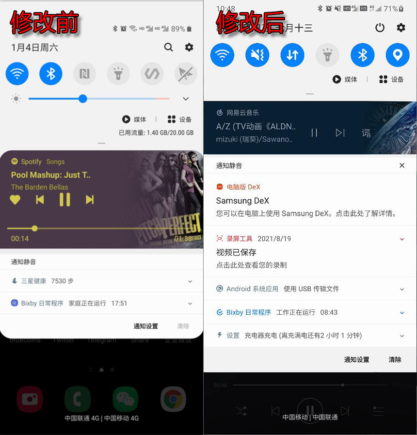

基础知识
---
**再开始之前, 首先需要了解一下基础知识**

**1. 安卓系统的UI构成**

* 安卓系统的界面呈现都是由内置在系统的APP构成的, 其APP一般位于 `/system/app` 和 `/system/priv-app`, 还有一个系统APP引用的公共框架APP, 位于 `/system/framework/framework-res.apk`, 部分系统例如[Flyme](https://www.flyme.com/)在此目录还会有另外一个自己的框架APP, 命名通常以自家OS命名, 此处不作过多介绍, 界面中比较常见的APP如下
* `framework-res.apk` 系统应用引用的界面, 例如提示信息弹窗
* `SystemUI.apk` 系统通知栏界面, 通知弹窗界面
* `Settings.apk` 系统设置界面, OneUI中此APP名称为 `SecSettings.apk`
* `Messages.apk` 短信界面, OneUI中为`SamsungMessages_11.apk`
* `Gallery.apk` 相册界面, OneUI中为`SamsungGallery2018.apk`
* `Dialer.apk` 拨号器,通话记录,联系人界面, OneUI中为`SamsungDialer.apk`
* `Clock.apk` 时钟,闹钟,计时器界面, OneUI中为`ClockPackage.apk`
* `Finder.apk` OneUI启动器(桌面)独有的搜索组件

**2. 安卓实现圆角的基本方式**

* 简单的实现安卓圆角可以通过`<Shape>`来实现, 其中`<Corner>`节点的属性`xxxRadius`为关键属性, 例如`bottomRightRadius`
* 通常是APP开发者为了减少代码重复率, 会定义一个统一风格而定义的一个统一的资源文件`dimens.xml`, 所有用到同样值的地方都会引用这个文件, 方便修改和风格统一

开始修改
---

首先修改`framework-res.apk`, 由于需要对源码反编译和回编译, 所以需要用到安卓反编译工具 [ApkTool](http://ibotpeaches.github.io/Apktool/), 本人修改时使用的版本为`v2.4.1`

首先使用命令进行反编译

```
apktool d framework-res.apk
```

中途没有错误则表示反编译成功

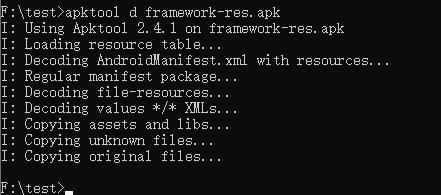

即可在当前目录生成反编译后的源码文件夹

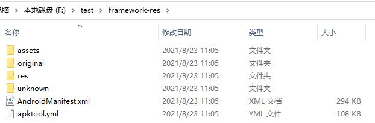

目录简单介绍下

* `assets` 为APP所用到的额外资源文件包, 可以是任何东西
* `original` 顾名思义存放原始文件
* `res` APP所用到的资源文件, 例如图标, 国际化文本, 图形, 布局文件等
* `unknown` 工具无法解析的文件, 回编译后会按照原样编译进去
* `AndroidManifest.xml` APP清单文件, 记录了版本号, 包名, 权限等重要信息
* `apktool.yml` 记录了[ApkTool](http://ibotpeaches.github.io/Apktool/)回编译时需要参考的信息

可以看到在此`framework-res.apk`中仅定义了资源文件, 并没有代码文件, 有代码的APP将在下文介绍, 在此`framework-res.apk`中, 只需要关注`res`文件夹下的资源文件就行, 我们把整个文件夹用IDEA打开, 然后根据圆角的基础知识, 直接简单粗暴先从搜索Radius开始

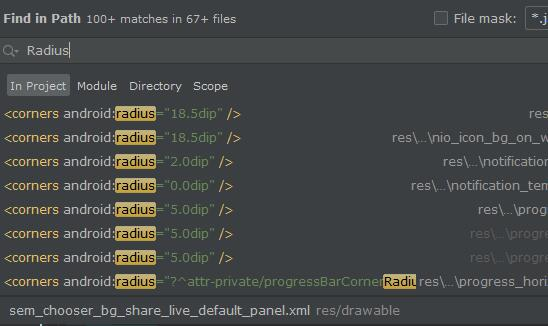
  
发现多处结果, 我们缩小一下搜索范围, 可以自己写一个小的安卓应用, 定义个圆角并尝试不同圆度, 根据多次测试观察到资源文件中圆度值为`26.0dip`的比较符合, 因此搜索`radius="26.0dip`, 可以发现结果少了很多

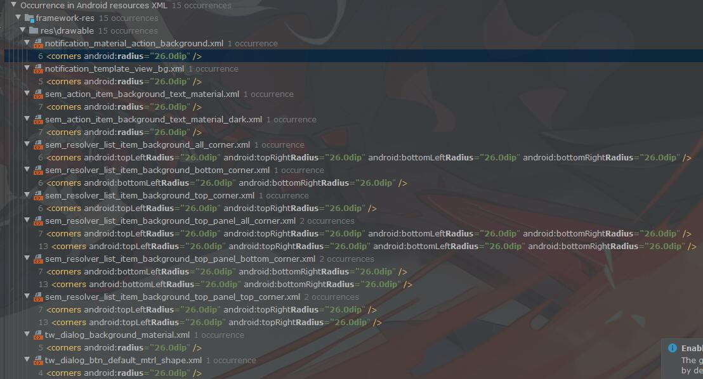

接着根据资源文件命名可以大致猜出这些对应的都是哪些部分的圆角, 例如`notification_template_view_bg.xml`应该就是定义的通知模板背景, 根据经验这些都可以改成直角, **因此直接将所有的`26.0dip`修改为`0.0dip`**

之后, 为了更彻底的覆盖所有部分, 继续深入搜索, 只搜索`26.0dip`, 发现更多结果

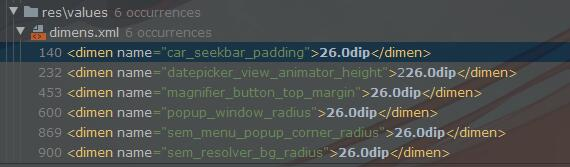

例如在`dimens.xml`中定义的一些值为`26.0dip`的数据, 需要仔细观察其`name`, 因为不是所有值为`26.0dip`的都需要修改, 例如第一行的`car_seekbar_padding`看名字就知道是一个填充值, 这个是不需要修改的, 但是下面的`sem_menu_popup_corner_radius`这种是需要修改的, 主要是经验和推测, 我们将这些需要修改的统统修改为`0.0dip`

所有圆角修改完之后, 开始回编译, 在反编译出来的目录下, 执行命令

```
apktool b framework-res
```
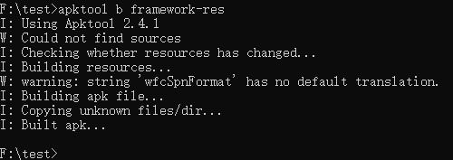

像这样没有错误说明回编译成功了, 打开`framework-res`文件夹, 会发现里面多了两个文件夹

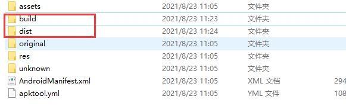

*  `build` 回编译构建编译后的资源文件
*  `dist` 回编译后生成的APK文件
  
打开`dist`文件夹, 可以看到生成的`framework-res.apk`文件, 接下来需要将它替换到系统里去

我们有四中方式替换

1. 使用电脑ADB工具执行命令行替换 (简单快捷, 有一定风险)
2. 复制到手机使用RE管理器替换 (风险较大)
3. 制作成单刷包替换 (安全性较好, 稍微麻烦一点)
4. 制作成ROM刷机替换 (性价比不高, 不考虑)

由于可能需要多次测试效果, 且有多个APK需要修改, 这里采用第一种方式, 需要ROOT

步骤如下
1. 打开手机里的USB调试
2. 电脑安装手机的ADB驱动 (每个厂家的手机不一样), 装好后使用USB连接手机
3. 使用安卓ADB工具执行命令如下

```
//1.将新生成的APK复制到手机存储根目录
adb push framework-res.apk /sdcard/framework-res.apk

//2.执行shell
adb shell

//3.获取超级用户权限
su

//4.复制手机存储的framework-res.apk到系统框架目录
cp /sdcard/framework-res.apk /system/framework/framework-res.apk

//5.将复制进去的新APK重设rw-r-r权限
chmod 644 /system/framework/framework-res.apk

//6.退出shell
exit

//7.重启手机
adb reboot
```

经过这一系列操作后, 如果没有出现意外, 手机重新开机后就可以看到修改后的效果了, 首先迎面而来的就是手机基础弹窗已经变成直角了

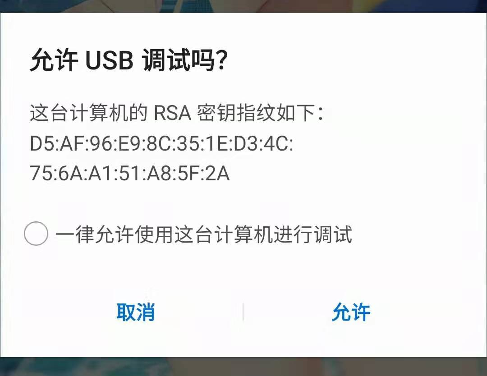

> **注意!!! 通常为了防止意外情况发生导致无法开机,需要通过`Recovery`备份一次系统,并将备份的系统复制到电脑以防万一,嫌麻烦的话至少也得有一份完整的刷机包,最好制作一份单刷包,如果修改后无法正常进入系统,推荐优先使用单刷包,如果单刷包无法生效,可以使用`Recovery`还原系统,如果没有备份系统的,则使用完整的刷机包重刷,但将丢失所有数据(双清的情况),关于单刷包的制作,我将在文章尾部补充**

但是这还远远不够, 接下来开始处理`SecSettings.apk`, 仍然使用[ApkTool](http://ibotpeaches.github.io/Apktool/)按照上文命令进行反编译, 不过在此之前, 需要先给[ApkTool](http://ibotpeaches.github.io/Apktool/)安装`framework-res.apk`

>由于系统APP会引用到框架APP, 因此需要给[ApkTool](http://ibotpeaches.github.io/Apktool/)安装框架APP, 才能继续反编译系统APP

通过如下命令安装`framework-res.apk`

```
apktool if framework-res.apk
```

安装之后就可以开始反编译`SecSettings.apk`了, 反编译成功之后会发现相比较`framework-res.apk`, 多出了几个文件夹

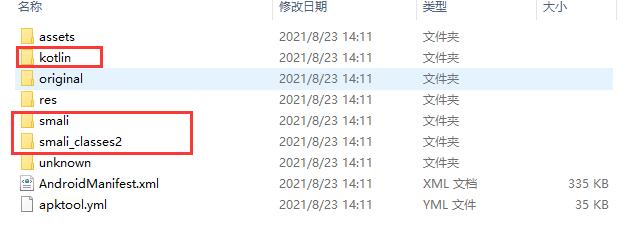

其中`smali`和`smali_classesX` 就是应用的源代码文件, 为`.smali`格式的Java字节码, 类似`C`程序反编译出来的汇编代码, 我们先使用上文的知识将圆角值为`26.0dip`的圆角修改为`0.0dip`, 替换进系统后发现只有一部分界面的圆角变成了直角

> 文章编辑于2021年8月, 系统修改于2020年7月, 当时没有保留截图, 现在也没有重新替换的必要, 因此这部分只能描述了

继续检查所有可能造成圆角的值为`26.0dip`的`.xml`文件, 仍然无法找到可能存在问题的部分, 此时将检查范围扩大到源代码文件, 为了方便阅读, 首先使用[Jadx](https://github.com/skylot/jadx)反编译`SecSettings.apk`, 并将反编译后的`.java`源码导入IDEA进行观察, 搜索`26`发现一个可疑的方法`initRoundedCorner`

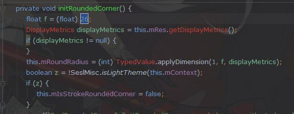

此处推测应该是初始化一个圆度为`26.0dip`的圆角, 而且这个类是很多类的父类, 应该是从代码层指定了圆角的圆度, 但是此时的`.java`源码无法直接修改, 我们回到[ApkTool](http://ibotpeaches.github.io/Apktool/)反编译出来而得到的`.smali`源码, 根据类名方法名找到对应在`.smali`代码中的`initRoundedCorner`如下

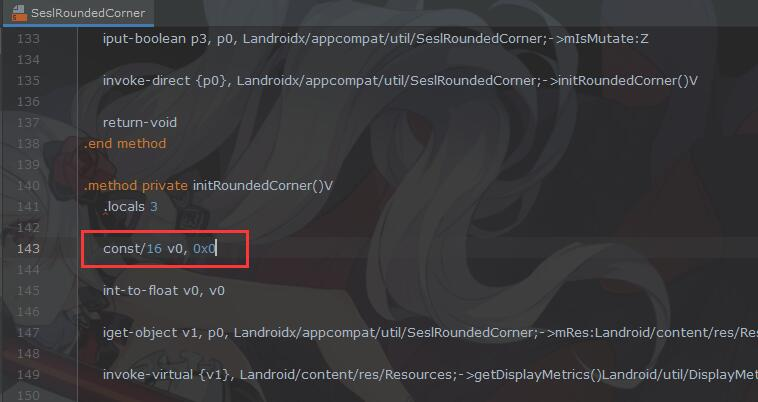

`smali`代码中的第一行也是定义了一个值为26的变量, 直接将`0x26`改成`0x0`, 然后回编译替换进系统观察效果, 此时可以看到界面基本上已经变成直角了

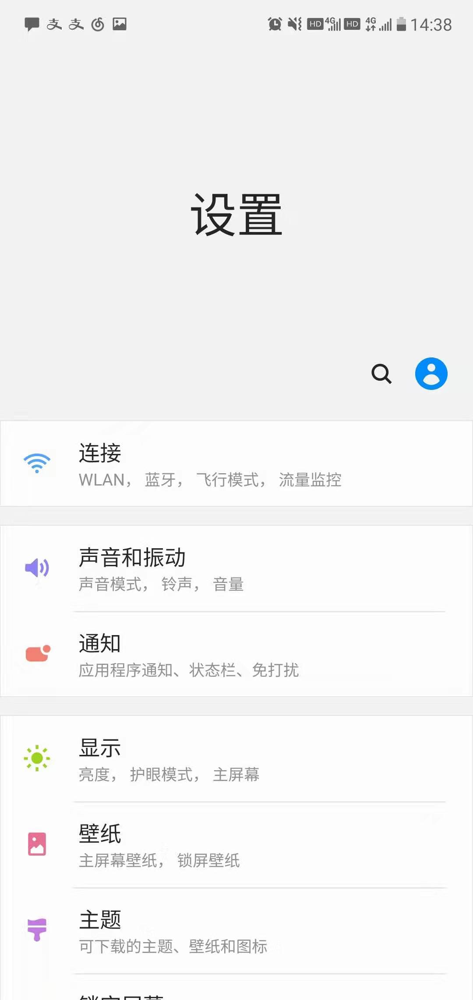

但是进入某些功能的深层选项时会发现仍然有一小部分是圆角的, 不过仔细观察这部分的圆角角度值大概在`15.0dip`到`16.0dip`左右, 因此继续搜索圆角值为这些的部分, 根据名称将可能的地方修改为`0.0dip`即可, 至此`SecSettings.apk`全部改完

接下来按照同样的步骤修改上文列出的剩余的系统APP即可

关于单刷包的制作
---

关于单刷包是什么, 有什么作用, 优缺点等网上已经有大量介绍, 此处不多说明, 仅介绍Note10下单刷包的制作


**制作OneUI单刷包**

首先我们需要一个完整的`.zip`刷机包, 以我的为例, 假定我们需要保留的文件为`SecSettings.apk`, 需要删掉除`SecSettings.apk`及其父文件夹以外的东西

> 尽量不要解压修改, 有时候解压了修改再压缩回去会出现奇奇怪怪的问题, 导致签名无法识别, 无法刷入

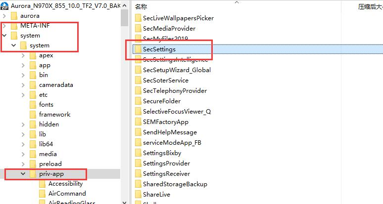

例如此处图示的部分, 红框以外的都是可以删除的, 删完后如下

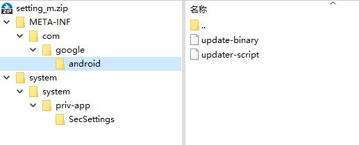

> 从原始刷机包删除目标以外的东西做成的单刷包通常用于备份恢复, 如果是为了替换成其他文件, 例如需要做成单刷修改后的`SecSettings.apk`, 则删除多余文件后, 将修改后的`SecSettings.apk`替换到单刷包里的对应目录即可

接下来需要修改刷机脚本, 原始的刷机脚本通常会做很多事, 但是单刷包不需要, 我们打开位于`META-INF/com/google/android`下的`updater-script`文件, 可以看到如下代码

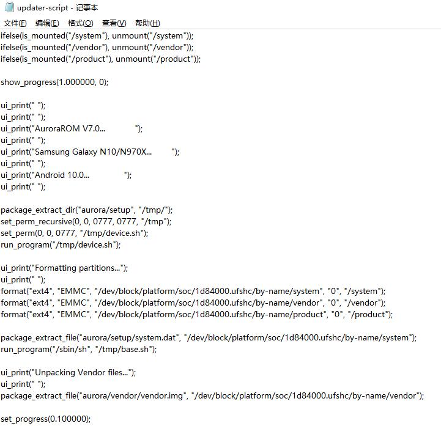

脚本语言为`updater-script`, 具体语法以及含义可以自行查阅, 此处不多作介绍, 我们将内容修改如下

```
ui_print("Mounting system");
ui_print("");
mount("ext4", "EMMC", "/dev/block/platform/soc/1d84000.ufshc/by-name/system", "/system");
ui_print("Copying modules");
ui_print("");
package_extract_dir("system", "/system");

ui_print("Unmounting system");
ui_print("");
unmount("/system");

show_progress(0.100000, 0);
```

其中关键代码为 `mount`挂载`/system`为可写分区, `package_extract_dir`将压缩包中`system`文件夹全部复制到系统的`/system`目录, `unmount`取消挂载, 其他的例如`ui_print`和`show_progress`仅为提示作用, 修改完成后, 一个单刷包就制作完毕了, 可以像普通刷机一样直接刷进系统


结语
---

由于安卓的开源特性使得安卓的可玩性和定制性非常高, 我所入手的每一部安卓手机都会进行ROOT并做一定程度的修改, 最开始的时候参考前辈的教程修改了系统APK的各种背景, 特效, 音效, 性能调优, 开机动画之类的, 随着手机UI越来越美观功能以及本人时间精力越来越有限, 现在对这种定制需要也已经越来越少了, 加之谷歌对安卓开源的策略调整以厂商的限制, 进行定制也越来越麻烦了, 但我仍会继续热爱安卓, 希望安卓开放的特性能够保持下去


