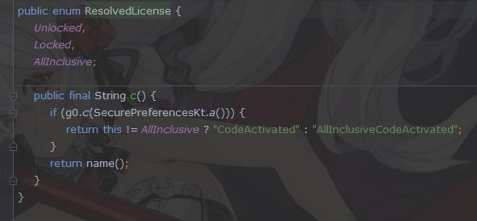

背景
---
最近发现一直在用的某抑云音乐越来越不行了, 没版权下架歌曲我可以理解, 但下架了也不告诉具体下架了哪些歌曲, 害得我都不知道该怎么找. 更无语的是我自己上传到某易云盘的歌曲都会因为版权问题无法添加到歌单, 而它自身的本地播放功能做的又太垃圾, 于是只能另谋出路, 在[Google Play](https://play.google.com)上找到一款本地播放器, 兼顾美观和功能简单实用, 不过免费版有点小广告, 然后试了几款去广告的插件, 都不能完美去除, 而我作为强迫症决定一定要处理掉

目标
---
去掉各处的广告以及订购按钮

APP界面以及广告
--


开始破解
---
打开[Jadx](https://github.com/skylot/jadx), 直接把安装包即`.apk`文件拖进去, 发现软件没有加壳, 顺利反编译出了播放器源码, 然后直接按 `Ctrl + S` 将源码全部保存, 然后导入`IDEA`, 开始分析代码


可以看到虽然源码没有加壳, 但还是有做混淆的, 不过问题不大, 首先通过[Android Device Monitor](https://developer.android.google.cn/studio/profile/monitor)解析一下当前页面的布局


发现主界面中的歌曲列表部分组件的`id`为`content`, 于是全局搜索`@+id/content`


发现多处搜索结果, 根据当前APP所在界面以及布局文件命名推测`mian_layout`应该是其布局文件, 分别看看上面的`viewAnim`和`viewAnimWithoutBackground`, 这两个`id`在当前[Android Device Monitor](https://developer.android.google.cn/studio/profile/monitor)解析的界面中都能找到对应节点, 验证了猜想, 如下图


现在要找展示广告的组件了, 通过刚才的搜索结果可以看到, 在`main_layout`中并没有存在疑似专门用于展示广告的节点, 所以还是很有可能是在运行过程中动态添加的, 于是我们直接搜索`main_layout`, 找到使用到此布局的`MainActivity`


由于暂时没有其他线索, 先看看`onCreate`源码能不能发现什么


可以看到实现比较简单, 再看看在父类的代码, 来到`D2`方法, 有多个实现, 这里看`MainActivity`的实现


都是一些混淆代码, 咱也看不懂, 凭直觉都过一下, 此时在`D2`中就发现可疑类`GooglePlayPurchaseChecker`


考虑到APP是从[Google Play](https://play.google.com)上下载的, 可以在[Google Play](https://play.google.com)上购买进行解锁, 那么这个类名就显得很可疑了, 跟踪进去看看都写了啥


首先直接内部调用 `aVar.g`, 继续跟踪


发现这里的`LinkedHashMap`中存放了名为`stellio_all_inclusive`和`stellio_premium`的键, 首先这俩键的名字就很可疑, 而他们的值存储为布尔, 此时注意到有枚举`ResolvedLicense`用于分辨APP解锁状态



**综合起来推测这个`Map`应该就是用于初始化一个授权值的, 以给定键的布尔值是否为`true`来判断应用是否已经购买, 那么我只要在初始化的时候把这个`Map`的值固定写死成`true`, 应该就可以让APP认为已经购买过了, 编写`Xposed`代码如下**

```
findAndHookConstructor("air.stellio.player.Helpers.GooglePlayPurchaseChecker",
    loadPackageParam.classLoader,
    "air.stellio.player.Activities.u",
    "org.solovyev.android.checkout.F",
    Map.class, new XC_MethodHook() {
        @Override
        protected void beforeHookedMethod(MethodHookParam param) throws Throwable {
            MyLog.log("hookin GooglePlayPurchaseChecker()", doLog);
            Map<String, Boolean> arg3 = (Map<String, Boolean>) param.args[2];
            if(null == arg3) {
                arg3 = new LinkedHashMap<>();
                param.args[2] = arg3;
            }
            arg3.put("stellio_all_inclusive", true);
            arg3.put("stellio_premium", true);
        }
});
```

**观察`GooglePlayPurchaseChecker`类中的赋值代码可以发现, 主要是通过构造函数将`Map`的值存储的, 因此使用`Xposed`的`findAndHookConstructor`去挂钩`GooglePlayPurchaseChecker`的构造函数, 在构造函数执行之前, 修改传入的第三个参数`Map`, 把键为`stellio_premium`和`stellio_all_inclusive`的值存为`true`, 这样当构造函数执行的时候, 会永远认为这是已订购的了**

安装模块并运行, 此时可以发现APP中的广告以及订购按钮都没有了


