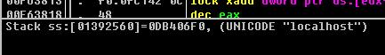

引言
---
本文接另一篇文章 [某乐谱网站Flash播放器破解记录](../xtan_flash_hack/index.md)

由于乐谱网站改版正式使用exe播放器之后, 删除了所有的`.ypa2`资源, 导致我没有及时下载的乐谱都无法继续使用Flash播放器播放了, 忍不了, 只能破解exe播放器了

目标
---
破解该站的exe播放器, 使其能够免费播放VIP乐谱, 且可以完全脱机使用

开始破解
---
首先安装网站的乐谱播放器, 打开安装目录发现文件结构如下


其中`xxxchrome.exe`相当于一个浏览器, 可以访问乐谱网站, 点击"客户端播放"按钮即可打开播放器, 如下图


而`xxplayer.exe`才是播放器, 播放器启动后, 可以从任务管理器看到新增的进程


剩下的安装文件和库文件还有配置文件, 就不介绍了.

首先播放一个免费的乐谱, 在任务管理器中查看一下`xxplayer.exe`的启动参数


完整的启动参数如下

```
"C:\Program Files\马赛克music\out1\马赛克player.exe" "file=http://www.马赛克.com/open_yp.php?ypid=73981&uid=999999999&token=fbf0ab24ee47bfa1cb460e41c1f61fdb&ypid=73981"
```
可以看到启动参数主要为
* `file` 官网的乐谱页地址
* `ypid` 乐谱ID
* `uid` 用户ID
* `token` 凭证

如果从`xxxchrome.exe`打开一个VIP乐谱, 则会显示


那么如果我不用他的`xxxchrome.exe`, 直接从命令行启动`xxplayer.exe`, 传入一个VIP乐谱ID, 会发生什么呢?

将刚才的启动参数中的`ypid`参数修改为一个VIP乐谱ID, 通过命令行

```
xxplayer.exe "file=http://www.马赛克.com/open_yp.php?ypid=33418&uid=999999999&token=4c6930a47090c3f04c7e9db3bf214078"
```

启动`xxplayer.exe`之后如下


非常的正常, 但是至少验证了 **`xxplayer.exe`是可以脱离`xxxchrome.exe`独立运行的**, 那么既然要鉴权, 不请求服务器肯定是不行的吧? 于是打开`Charles`开始抓包, 首先用命令行打开一个免费的乐谱, 捕获到网络请求如下


可以看出主要请求接口为`/codeindex.php`, 通过参数`m`做不同功能的权限认证

**当`m=index`, 验证成功返回权限信息**
```
{
	"responseCode": "1000",
	"message": "\u6b63\u5e38",
	"power": {
		"openPower": "1",
		"printPower": "0",
		"printCount": "30",
		"vstPower": "0",
		"pdfPower": "0"
	}
}
```

**当`m=getYpdsUrl`, 验证成功返回`.ypdx`格式的播放文件地址**
```
{
	"data": {
		"code": "1000",
		"message": "\u83b7\u53d6\u6210\u529f",
		"result": {
			"ypdsUrl": "http:\/\/马赛克.马赛克.com\/yuepuku\/148\/74205\/74205_cfcbahia.ypds",
			"ypdxUrl": "http:\/\/马赛克.马赛克.com\/yuepuku\/148\/74205\/74205_cfcbahia.ypdx"
		}
	}
}
```
**最后再请求资源地址`http:\/\/马赛克.马赛克.com\/yuepuku\/148\/74205\/74205_cfcbahia.ypdx`, 得到`.ypdx`格式的播放文件**

现在再来通过命令行启动一个VIP乐谱,看看请求和响应会是怎样的


可以看到这次只有一个`m=index`的请求, 且返回码不同于免费乐谱的`1000`, 之后播放器弹出没有权限的弹窗, 那么思路就来了

**如果我将篡改请求的响应,播放器应该就会认为我是有权限的,那不就可以播放了吗?**

首先使用`Charles`进行断点, 针对`m=index`的请求, 修改播放器请求VIP乐谱的返回值


**和我预料的一样, 修改`m=index`的响应后, 这次发送了`m=getYpdsUrl`的请求**

但是`m=getYpdsUrl`仍然对用户权限进行了判断, 因此返回码不是正常的`1000`, 且`result`节点没有返回`.ypdx`播放文件的资源地址, 看样子不是VIP用户是无法获得资源地址了

# 但是

**在文章 [某乐谱网站Flash播放器破解记录](../xtan_flash_hack/index.md) 中, 使用`getURL`生成的乐谱信息url去请求乐谱服务器得到的返回值里, 是包含`.ypa2`格式的资源地址的, 只不过现在`.ypa2`资源已经被删了, 不过观察刚才免费的乐谱`.ypdx`资源地址后, 会发现这和`.ypa2`的资源地址高度相似! 于是我将返回的`.ypa2`资源地址修改后缀名为`.ypdx`进行请求之后, 顺利得到了`.ypdx`格式的播放文件!**

```
//ypa2请求地址
http://oss.马赛克.com/yuepuku/115/57806/57806_hhdafigb.ypa2

//ypdx请求地址
http://oss.马赛克.com/yuepuku/115/57806/57806_hhdafigb.ypdx
```

得到`.ypdx`文件之后, 开启一个本地HTTP服务器, 开放一个地址用于返回`.ypdx`文件, 然后用`Charles`对VIP乐谱请求中`m=getYpdsUrl`断点, 并修改响应中`result`里对应的资源地址为本地HTTP服务器地址

```
{
    "data":
    {
        "code":"1000",
        "message":"\u83b7\u53d6\u6210\u529f",
        "result":
        {
            "ypdsUrl":"http:\/\/127.0.0.1:7777\/yuepu\/57806_hhdafigb.ypds","ypdxUrl":"http:\/\/127.0.0.1:7777\/yuepu\/57806_hhdafigb.ypdx"
        }
    }
}
```

再次测试, **成功打开VIP乐谱, 并开始播放, 所有功能正常!**


确定伪造响应的方案确定可行之后, 下一步就是要让播放器请求我指定的地址了, 因为刚才是通过`Charles`修改响应的, 但我不可能每次都使用`Charles`断点, 我需要反编译`xxplayer.exe`, 并修改服务请求地址为我监听的地址, 然后由我监听的地址返回所需数据

使用`OllyDbg`(以下简称`OD`)反汇编`xxplayer.exe`, 在菜单栏依次点击 "插件" -> "中文搜索引擎" -> "搜索UNICODE", 以`Charles`捕获到的url中的关键字`codeindex`搜索, 发现一共有三处


>Warning: 此处我没有使用虚拟机打开, 建议各位反汇编的时候用虚拟机, 因为被反汇编的程序如果有反调试的代码, 轻则闪退重则格盘. 另外`OD`本身是不带"中文搜索引擎"插件的, 需要自行下载安装

双击搜索到的第一处字符串, 跳转到引用代码段, 通过字符串格式可以看出, 其中`%s`是要用参数替换的, 且通过前面的`push`可以看出, 它自身也是作为参数被传递的, 那么只要跟踪下方离他最近的`call`之前的变量, 就能确定需要修改哪一行了, 在可疑的`push`处按`F2`断点, `F8`单步调试后, 发现`push [local.7]`正是请求的域名


为了修改字符串, 有两种方式
1. 如果修改前后字符串长度相同, 可以直接定位到字符串地址进行修改
2. 如果长度不同, 可以在程序空白处, 新增一段字符串, 然后将之前对字符串的地址引用改为新增的字符串地址

>程序空白处是指在`OD`左下角的数据面板, 拉到最下面, 可以看到一堆`00 00 00 00 00 00 ...`, `00`在汇编中就是啥都没有, 啥都不干, 也就是空白的意思

这里暂时不知道`[local.7]`哪儿来的, 所以我选择第二种方式, 查看`OD`左下角数据面板, 拉到最下面, 找到程序空白处, 双击空白地址, 在弹出的编辑窗口中取消勾选"Keep size", 在`UNICODE`栏输入`localhost:7777`


>Q1: 为什么不在`011808E0`行的`6C 65 57`后面的`00`处添加, 而是在`00`的后面?
>>因为汇编中字符串是以`00`结尾, 且每个字符后面都跟一个`00`, 为了尽量避免覆盖前面的数据块, 这里空开一个`00`位置, 如果前面数据块明显是字符串,需要空开三个`00`, 因为结束符`00`后面也会跟一个`00`

>Q2: 为什么取消勾选"Keep size"
>>Keep size的作用是保持长度字符串长度一致, 因为如果超过原来的长度会造成不可预知的错误, 但是这里是程序空白处, 后面都是空白行, 所以不需要保持长度, 有多少写多少

此时点击新增的字符串头`6C`可以在底部栏看到新字符串的起始地址为`0x11808E4`, 回到汇编面板, 双击刚才的`push [local.7]`所在行, 在弹出的面板中修改为 `push 0x11808E4`

>由于修改后的代码较之前的代码更少, 需要勾选"Fill with NOP`s"来保持长度一致


可以看到在汇编面板右侧已经自动显示了标记, 提示当前`push`的值为`localhost:7777`


现在选中刚才在数据面板添加的字符串十六进制代码块, 右键点击"复制到可执行文件", 再选中汇编面板所有修改的行, 右键点击"复制到可执行文件" -> "选中行", 在弹出的面板中右键"备份" -> "保存数据到文件"即可保存修改后的exe文件


执行修改后的程序, 发现程序异常退出, 用`OD`打开修改后的文件, 再次找到刚才修改`push`的地方, 发现右侧没有显示`localhost:7777`的标记


再看看跳转地址`0x11808E4`, 也不是刚才修改的字符串内容


虽然不知道为什么, 但是看来`push [local.x]`形式的代码不能这样简单的修改. 那么换个角度想想`[local.7]`的值是哪里来的, 这时突然想到播放器启动的时候, 带的参数里是有一个网址的

```
file=http://www.马赛克.com/open_yp.php?ypid=73981&uid=999999999&token=fbf0ab24ee47bfa1cb460e41c1f61fdb&ypid=73981
```

我将这个网址修改为百度的网址

```
file=http://www.baidu.com/open_yp.php?ypid=73981&uid=999999999&token=fbf0ab24ee47bfa1cb460e41c1f61fdb&ypid=73981
```
重新运行, 抓包发现它真的去请求百度的`/codeindex.php`接口了


于是我再将参数换成`localhost:7777`, 重新运行, 结果发现程序异常退出, 进行跟踪调试发现`[local.7]`的实际值被截取了不包含端口号的部分, 为`localhost`



尝试跟踪截取部分的代码, 但是太麻烦了决定放弃. 这时候我想到直接将整个url

```
%s://%s/codeindex.php?d=api&c=check马赛克playerPower&m=%s&ypid=%d&uid=%d&token=%s
```
中第二个`%s`直接替换成`localhost:7777`不就可以了? 但是这样就少了一个`%s`, 参数对不上后面的代码一定会报错, 于是我想到在`?`后面再加一个参数, 参数名随意, 参数值就用`[local.7]`, 反正对于串来说, `%s`的数量能够对应参数的数量即可, 而对于HTTP请求来说, 多一个参数也没什么影响. 不过修改后字符串的长度就对不上了, 所以还是在程序空白处添加了一个新的字符串如下

```
%s://localhost:7777/codeindex.php?a=%s&d=api&c=check马赛克playerPower&m=%s&ypid=%d&uid=%d&token=%s
```


其中`a`就是新增的无用参数, `a`后面跟的`%s`将会被`[local.7]`的值替换, 这样一来无论启动参数中的域名是什么都无所谓了. 记录新字符串的地址为`0x11808E4`, 找到`push`原来字符串的汇编代码, 修改`push`地址为新的字符串地址


再次保存执行, 程序还是异常退出, 用`OD`打开修改后的程序发现地址正确, 字符串正确, 但是还是会报错, 于是我怀疑不能用`localhost`作为域名. 将`localhost:7777`修改为`127.0.0.1:7777`, 再次运行, 这次终于在后台收到了来自播放器的HTTP请求!


所有参数也都正常接收, 接下来只要返回正确的响应就行了, 对于`m=index`的直接返回

```
{"responseCode":"1000","message":"\u6b63\u5e38","power":{"openPower":"1","printPower":"0","printCount":"30","vstPower":"0","pdfPower":"0"}}
```

对于`m=getYpdsUrl` 的则返回

```
{
    "data":
    {
        "code":"1000",
        "message":"\u83b7\u53d6\u6210\u529f",
        "result":
        {
            "ypdsUrl":"http:\/\/127.0.0.1:7777\/yuepu\/57806_hhdafigb.ypds","ypdxUrl":"http:\/\/127.0.0.1:7777\/yuepu\/57806_hhdafigb.ypdx"
        }
    }
}
```

然后, 用同样的方式修改搜索`codeindex`结果中的第二处, 再次运行就能正常播放了.

继续破解
---

**现在虽然播放曲谱没有问题了, 但是现在还有如下几个VIP功能用不了, 要白嫖就白嫖到极致**


从音源开始下手, 点击"音源" -> "浏览"后, 播放器弹出没有权限的提示


查看`Charles`发现期间并没有发出网络请求, 推测应该是在之前的请求里就响应过了, 这时想到最开始`m=index`的请求中, `power`节点有很多为`0`的字段, 仔细一看这不就是对应的权限吗? 推测权限字段对应关系应该是

* `openPower` 打开的权限
* `printPower` 打印的权限
* `printCount` 可打印的数量
* `vstPower` 使用vst音源的权限
* `pdfPower` 转换pdf的权限
  
参考正常响应中`openPower`为1, 其他的为0, 因此把后台响应中所有为0改为1, 再次点击音源, 发现可以正常选择了

```
{"responseCode":"1000","message":"\u6b63\u5e38","power":{"openPower":"1","printPower":"1","printCount":"30","vstPower":"1","pdfPower":"1"}}
```


接下来看看点击转换PDF功能, 通过`Charles`发现会发送一个权限请求


其中接口仍然是`/codeindex.php`, 但本次`m`取值为`addDynamic`, 在`OD`中发现就是刚才上文`codeindex`搜索结果中的第三处


双击搜索结果字符串转到汇编代码,`00F63EAE` 处的`push`地址就是将要用来替换成请求域名的参数, 这个地址指向了乐谱网站的域名, 所以这里采用同样的办法, 先在程序空白处添加字符串`127.0.0.1:7777`, 然后修改`push`原来串的地址修改为新增的字符串地址


重新保存, 然后在乐谱工具中监听这个地址, 并参考`m=index`的响应以下结果

>乐谱工具是我基于`C#`开发的一款桌面应用, 其中包括乐谱管理功能, 可以管理所有下载的乐谱并调用Flash播放器播放, 同时开启了一个HTTP监听服务, 监听所有来自`localhost:7777`的HTTP请求

```
{"data":{"code":"1000","message":"\u6b63\u5e38","result":{"printCount":"30"}}}
```

重新打开运行PDF保存, 发现可以转换并保存了


打印的功能和PDF的请求地址和参数`m`是一样的, 只要返回同样的响应就可以了

**至此VIP功能全部破解**

但是尚不完美
---

最后做脱机测试的时候发现播放器会先检查网络连接状态, 没有网络连接则无法播放


但是我的目标是播放器能够脱机使用, 而且实际上播放器被我修改后已经不需要再连上互联网, 只需要请求乐谱工具的HTTP服务地址就可以, 因此根据弹窗搜索字符串, 定位到相关代码


可以看到播放器在`00F693E2`处调用系统接口得到网络连接状态, 在`00F693EC`处, 如果有网络连接则会跳转到`00F6940A`处继续, 没有网络连接则会显示并中断运行, 那我只需要让这个判断失效就可以了, 双击`00F693EC`打开编辑窗口, 将`jnz` (不等于0则跳转) 修改为`jmp` (无条件跳转), 这样运行至此的时候将不会判断网络连接状态, 直接运行后面的代码


同样的, 在使用转换PDF功能时还会检测网络状态, 然后弹窗提示"没有检测到网络!", 找到代码运行处, 修改`00F75DDE`处的`jnz`为`jmp`即可


保存后重新运行, 现在脱机情况下播放器能够正常打开并请求乐谱工具的HTTP服务并正常播放乐谱了, 转存PDF文件等VIP功能也能够正常使用

## 至此exe版本宣告完美破解


