背景
---
2019年的某月, 某乐谱网站将越来越多的谱子改为vip收费谱, 遂于网上寻找Chrome插件实现白嫖.

同年, 得知Adobe公司将于2020年年末彻底停用Flash, 遂产生破解其Flash播放器并本地化的想法.

目标
---
破解该站的Flash播放器, 使其能够免费下载并播放VIP乐谱, 并将乐谱保存至本地硬盘, 同时使播放器可以脱离浏览器且可以脱机使用

网站乐谱页
--
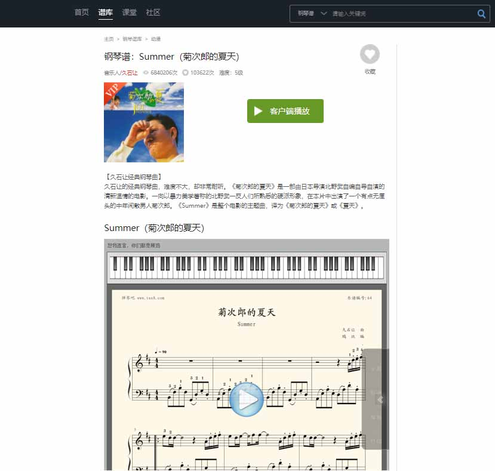

开始破解
---
**首先通过Chrome的调试控制台Network面板, 跟踪进入乐谱页的网络请求如下**
1. 进入乐谱页面, 网站向服务端请求 `player.swf`, 该 `.swf` 文件即为乐谱播放器
2. 浏览器加载 `player.swf` , 播放器向服务端请求乐谱的第一页作为预览图, 显示在播放器中
3. 点击播放按钮时, 播放器请求 `Sounds.swf`, 
4. 播放器请求接口 `/flash_get_yp_info.php` 获取乐谱详细信息, 包括谱名称, 页数, 作者, 余下的乐谱页资源地址, 播放文件地址
5. 播放器下载并载入余下的 `.png` 格式乐谱图片, 并加载 `.ypa2` 格式的播放文件, 即可开始播放

>由于文章编辑于2021年5月, 该网站已经改版移除了Flash版本播放器, 因此当时调用的服务器接口没有被记录下来, 文章没有该部分请求的截图

**基本过程已经明确了, 而所有的请求接口中, 只有第四步的`/flash_get_yp_info.php`是需要对入参`sccode`, `r1`, `r2`, 进行校验, 那我只需要反编译出播放器的源码, 再根据代码仿写一个凭证生成的算法, 不就可以调用接口并得到资源地址了?**

首先要实现下载乐谱图片以及播放文件, 多番对比后选用开源且免费的 [jpexs-decompiler](https://github.com/wholesky/ffdec), 顺利反编译出`player.swf`代码, 用IDEA新建为`Flex`项目打开, 再百度其中的一些`package`名称, 发现代码可基于 `flex_sdk_3.6a` 的SDK运行, 再从Adobe官网下载官方的Flash调试工具 [flash_player_debugger](https://www.flash.cn/cdm/latest/flashplayer_sa_debug.exe), 配合IDEA编译后可直接运行调试, 反编译出来的代码如下:

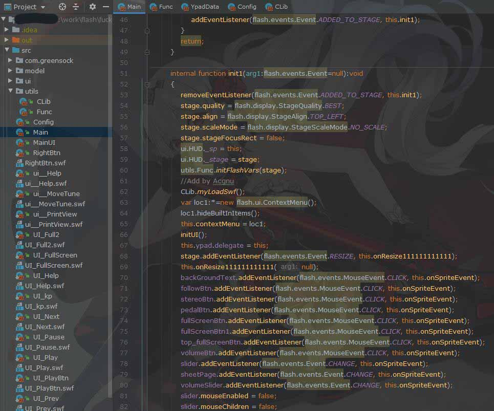

其中`Main`为主类, `init1` 为初始化函数, 这里可以得到入参, 参数传入形式为

```
player.swf?id=1
```

而配置类`Config`定义了服务端接口地址:

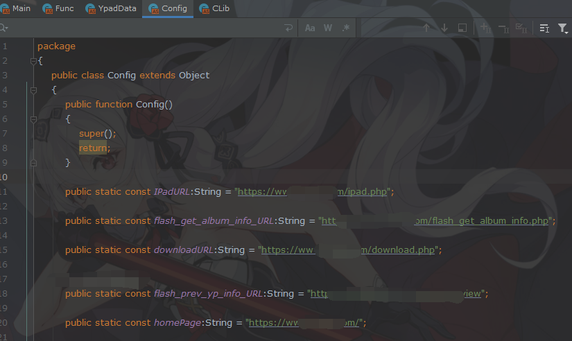

但是很遗憾在`player.swf`中的代码没有发现第四步获取乐谱信息的接口地址, 那么只能找其他突破口, 这时`Sounds.swf`就很可疑了, 通过阅读`player.swf`的代码发现`Sounds.swf`是点击播放按钮之后, 作为一个函数库被加载进来的, 这里`load`的地址就是`Config`里定义了`Sounds.swf`资源地址

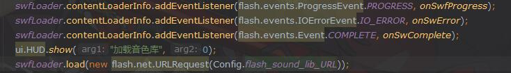

请求响应之后通过回调函数`onSwComplete`将其载入并储存到`Clib`类的成员变量`clib`中

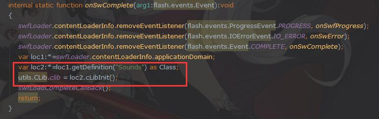

然后就可以通过`utils.Clib.clib.xxx`的方式调用函数, 再深入跟踪代码, 发现`Clib`中的`getURL`非常可疑

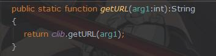

找到他被调用的地方, 加一行日志跟踪一下输出

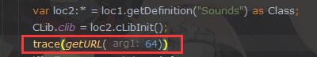

调试运行之后输出的字符串为:

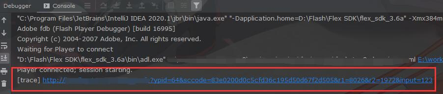

**这个地址跟第四步的请求地址就是同一个地址!** 这就是我要找的东西, 现在只需要反编译`Sounds.swf`, 把`getURL`的算法抄下来就可以了! 想法很美好, 但现实很骨感, `Sounds.swf`反编译后发现经过了加密混淆, 反编译出来的代码是这样的

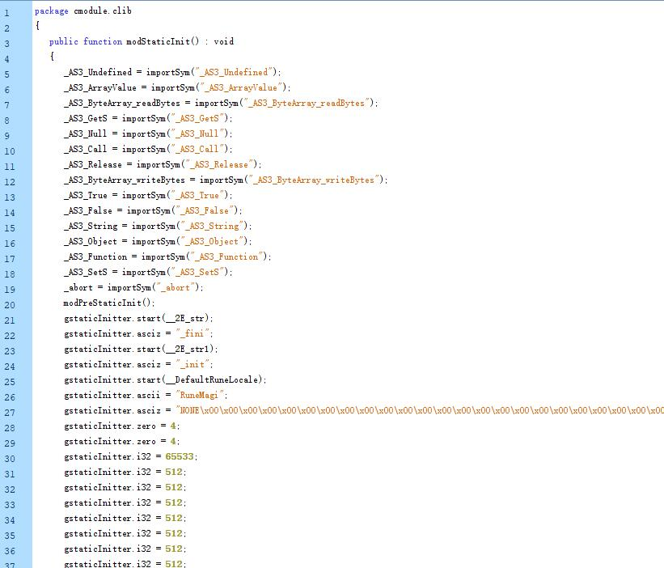

这代码别说放进去编译了, 甚至难以阅读, 但是在我坚持不懈的寻找下, 还是发现了一丝蛛丝马迹

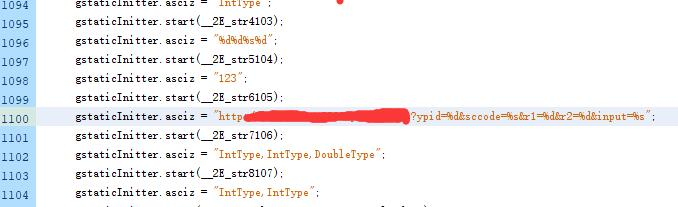

这url不就是刚才输出的地址吗, 显然此处的代码是将url中的`%s`, `%d`替换成对应的参数, 但参数值到底是怎么来的, 仍然无法查明, 于是我决定换个思路, 虽然我无法知道生成参数的具体算法, 但是别忘了这个`Sounds.swf`是一个函数库, 那我是不是可以写一个外部代码, 通过外部去调用`getURL`这个函数, 直接返回整个url? 这样所达到的最终目的仍然是一样的, 于是开始查询`ActionScript`资料, 发现可以通过`ExternalInterface`, 让`.swf`将接口暴露出来提供外部Flash容器调用, 对于`player.swf`来说, 容器就是浏览器, 而我不通过浏览器的话, 则可以使用`WinForm`的`Shockwave Flash`组件.

于是修改`player.swf`的源码, 在`Main`中定义一段可供外部调用的函数

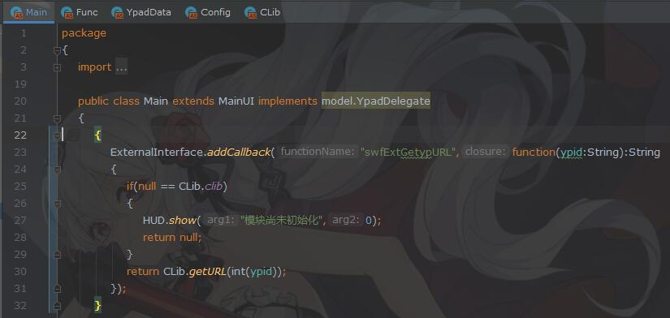

其中函数名为`swfExtGetypURL`, 入参为`string`类型的乐谱ID, 函数首先检查`clib`是否已经初始化完成, 没有初始化则提示错误, 初始化之后则调用`Clib`的`getURL`返回乐谱信息url. 

上文提到`clib`是在播放器点击播放按钮之后才开始加载的, 那我总不能每次调用前都先点一下播放按钮吧, 于是找到上文提到的初始化`clib`的函数`onSwComplete`, 仿照其代码, 在`Clib`中写一段初始化代码如下:

```
public static function myLoadSwf() : void
{
    swfLoader.contentLoaderInfo.addEventListener(Event.COMPLETE,onSoundsReady);
    swfLoader.load(new URLRequest(Config.flash_sound_lib_URL));
}

internal static function onSoundsReady(arg1:Event) : void
{
    swfLoader.contentLoaderInfo.removeEventListener(Event.COMPLETE,onSoundsReady);
    var loc1:* = swfLoader.contentLoaderInfo.applicationDomain;
    var loc2:* = loc1.getDefinition("Sounds") as Class;
    CLib.clib = loc2.cLibInit();
}
```

并将原来的初始化代码`loadSwf`修改为:

```
//修改前
public static function loadSwf(arg1:Function):void
{
    swfLoadCompleteCallBack = arg1;
    swfLoader.contentLoaderInfo.addEventListener(flash.events.ProgressEvent.PROGRESS, onSwfProgress);
    swfLoader.contentLoaderInfo.addEventListener(flash.events.IOErrorEvent.IO_ERROR, onSwError);
    swfLoader.contentLoaderInfo.addEventListener(flash.events.Event.COMPLETE, onSwComplete);
    ui.HUD.show("加载音色库", 0);
    swfLoader.load(new flash.net.URLRequest(Config.flash_sound_lib_URL));
    swfLoadCompleteCallBack();
    return;
}

//修改后
public static function loadSwf(arg1:Function):void
{
    swfLoadCompleteCallBack = arg1;
    if(null == CLib.clib)
    {
        swfLoader.contentLoaderInfo.addEventListener(flash.events.ProgressEvent.PROGRESS, onSwfProgress);
        swfLoader.contentLoaderInfo.addEventListener(flash.events.IOErrorEvent.IO_ERROR, onSwError);
        swfLoader.contentLoaderInfo.addEventListener(flash.events.Event.COMPLETE, onSwComplete);
        ui.HUD.show("加载音色库", 0);
        swfLoader.load(new flash.net.URLRequest(Config.flash_sound_lib_URL));
    } else {
        swfLoadCompleteCallBack();
    }
    return;
}
```

最后在`Mian`类的初始化函数`init1`中调用`myLoadSwf`

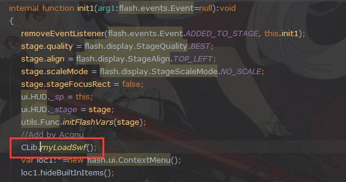

大功告成, 现在 `player.swf` 在启动的时候就会调用我添加的 `myLoadSwf` 函数, 开始加载 `Sounds.swf` 并初始化到 `Clib` 中. 而原来的`loadSwf`会先判断`Sounds.swf`有没有初始化, 初始化了就跳过初始化步骤, 然后我再通过`Shockwave Flash`组件调用`player.swf`暴露出来的外部接口就可以了, 调用方式如下:

```
axShockwaveFlash.CallFunction(
                string.Format("<invoke name=\"swfExtGetypURL\" returntype=\"xml\"><arguments><string>{0}</string></arguments></invoke>", ypid));
```
>`axShockwaveFlash` 是我在c#代码中定义的Flash容器组件成员变量, 它加载了`player.swf`作为内容, 代码中调用到的扩展函数名称为`swfExtGetypURL`, 也就是刚才在`player.swf`的`Main`中定义的`ExternalInterface`类型的函数, 参数为`string`类型的乐谱ID

得到返回的url之后, 使用url发起HTTP请求, 得到的响应如下:

```
<html><body>yp_create_time=<yp_create_time>1601587012</yp_create_time>  <br/>
yp_title=<yp_title>Summer（菊次郎的夏天）</yp_title>  <br/>
yp_page_count=<yp_page_count>5</yp_page_count>  <br/>
yp_page_width=<yp_page_width>1051</yp_page_width>  <br/>
yp_page_height=<yp_page_height>1487</yp_page_height>  <br/>
yp_is_dadiao=<yp_is_dadiao>1</yp_is_dadiao>  <br/>
yp_key_note=<yp_key_note>2</yp_key_note>  <br/>
yp_is_yanyin=<yp_is_yanyin>0</yp_is_yanyin>  <br/>
ypad_url=<ypad_url>http://www.手动马赛克.com//yuepuku/0/64/64_bidea.ypad</ypad_url>ypad_url2=<ypad_url2>http://www.手动马赛克.com//yuepuku/0/64/64_bidea.ypa2</ypad_url2></body></html>
```
**接下来, 只需要解析响应并下载资源就可以了**
* 解析 `yp_page_count` 节点可以得到乐谱的总页数
* 解析`ypad_url`节点, 并在节点中url的最后拼接`.乐谱页数.png`, 即可得到真实的乐谱图片地址
* 解析`ypad_url`节点, 截取 `_` 的前半部分, 再拼接 `_prev.jpg`还可以得到乐谱的封面图
* 解析`ypad_url2`节点即可获取真实的`.ypa2`格式的播放文件

>由于通过对浏览器Network的跟踪, 可以发现请求的资源地址和响应的乐谱信息资源地址高度相似, 由此可以推论出解析方式以及拼接方式

以上即完成了白嫖VIP乐谱的方式, 但播放器仍然会请求官方服务器地址, 达不到脱机使用的目的, 因此, 还需要对`player.swf`和`Sounds.swf`做一些修改, 首先修改`player.swf`的`Config`类, 把其中关键的加载`Sounds.swf`和获取封面的地址修改为`localhost:7777`

```
//获取曲谱封面的地址
public static const flash_prev_yp_info_URL:String = "http://localhost:7777/yuepu/preview";

//获取Sounds.swf的地址
public static const flash_sound_lib_URL:String = "http://localhost:7777/yuepu/flash/sound";
```

然后修改`Sounds.swf`在上文查找到的生成url串, 把串的前缀修改为`localhost:7777`
```
gstaticInitter.asciz = "http://localhost:7777/yuepu/info?ypid=%d&sccode=%s&r1=%d&r2=%d&input=%s";
```

>此处`Sounds.swf`修改url后, 调用`getURL`返回的url已经不再是乐谱网站域名了, 需要将返回的localhost域名修改回为乐谱网站域名之后再请求

最后在乐谱工具中开启一个端口为`7777`的HTTP的服务, 监听播放器请求的地址, 返回之前下载过来的的对应资源就行了

>乐谱工具是我基于`C#`开发的一款桌面应用, 其中包括乐谱管理功能, 可以管理所有下载的乐谱并调用Flash播放器播放, 同时开启了一个HTTP监听服务, 监听所有来自`localhost:7777`的HTTP请求

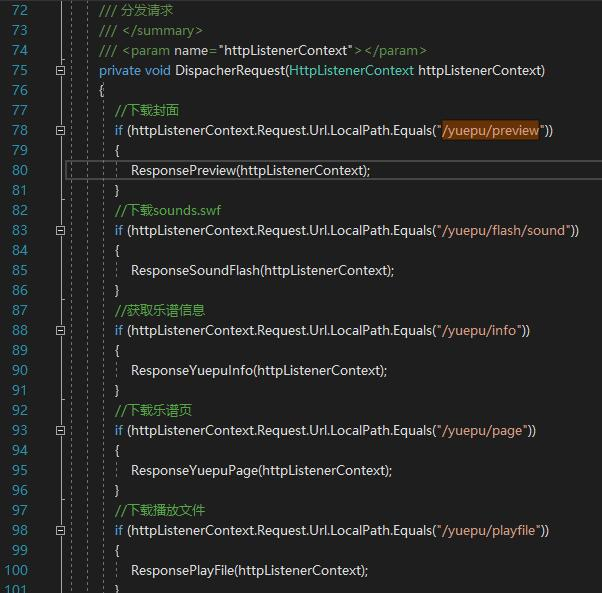

---
Adobe Flash彻底停用后的补偿方案
---

过以上修改之后, 就可以脱离浏览器, 嵌入到乐谱工具`WinForm`的Windows窗口中运行, 原以为可以高枕无忧了, 直到2020年底Adobe正式停用Flash, 受此影响, 浏览器都移除了对Flash的支持, 这是意料之中的事, 但是万万没想到安装版的Flash也受到了影响, **直接导致`Shockwave Flash`也无法加载Flash内容, 所以乐谱工具也无法打开播放器了.**

既然Flash已经被放弃, 那么继续使用其他低版本安装版的Flash就不考虑了, 本身Flash被代理添加了大量广告令人发指. 因此转念考虑上文的[flash_player_debugger](https://www.flash.cn/cdm/latest/flashplayer_sa_debug.exe), 这个是不需要安装的, 那么我是不是可以通过命令行的形式启动它, 并将需要播放的`.swf`文件作为参数传递给它? 由于没有查阅到相关文档, 只能按照习惯进行尝试了, 发现确实可行, 在命令行窗口输入以下命令

```
flashplayer_sa_debug.exe player.swf?id=1
```

即可启动 [flash_player_debugger](https://www.flash.cn/cdm/latest/flashplayer_sa_debug.exe) 并打开作为参数的 `.swf` 文件, 在`C#`中则可以使用`Process`启动, 代码如下:

```
Process.Start("flashplayer_sa_debug.exe", "Main.swf?id=1");
```

但是在实际使用中, 发现通过命令行或者程序启动的 [flash_player_debugger](https://www.flash.cn/cdm/latest/flashplayer_sa_debug.exe) 打开的`player.swf`无法发送`localhost`的网络请求, 弹窗报错如下:

```
SecurityError: Error #2119: 安全沙箱冲突
```

 但是通过IDEA启动的又可以, 查阅资料后最终确定是由于Adobe施加的安全策略影响, IDEA启动的能正常请求`localhost`是因为他在用户文件夹下`\AppData\Roaming\Macromediax\Flash Player\#Security\FlashPlayerTrust`创建了信任文件`intellij_idea.cfg`, 文件内容即IDEA生成`.swf`的完整文件夹路径

```
E:\flash\bin-debug
```

**所以, 我只需要为乐谱工具所在的文件夹也创建信任文件, 内容为乐谱工具完整路径, 就能正常打开并请求`localhost`了**

 现在解决了乐谱无法播放的问题, 但是由于[flash_player_debugger](https://www.flash.cn/cdm/latest/flashplayer_sa_debug.exe)不支持`ExternalInterface`, 因此需要通过其他方式获取乐谱信息url, 于是我想到在播放器启动的时候, 根据传入的乐谱ID, 直接调用`getURL`获取乐谱信息url, 并通过HTTP将url中的参数作为请求参数, 发送到乐谱工具开启的HTTP监听服务中, 再根据得到的参数请求乐谱网站获取乐谱详细信息.

首先删除会引起报错的`player.swf`中使用`ExternalInterface`定义的接口`swfExtGetypURL`, 修改 `myLoadSwf`中定义的回调函数 `onSoundsReady`, 在此前初始化`clib`的基础上加上调用`getURL`返回的url, 并提取参数请求`localhost:7777`, 修改后的代码如下:

```
internal static function onSoundsReady(arg1:Event) : void
{
    swfLoader.contentLoaderInfo.removeEventListener(Event.COMPLETE,onSoundsReady);
    var loc1:* = swfLoader.contentLoaderInfo.applicationDomain;
    var loc2:* = loc1.getDefinition("Sounds") as Class;
    CLib.clib = loc2.cLibInit();
    //添加的部分
    if(utils.Func.ypadId != 0) {
        var url:* = CLib.getURL(utils.Func.ypadId);
        var args:* = "?" + url.split("?")[1]
        urlLoader3 = new flash.net.URLLoader();
        urlLoader3.load(new flash.net.URLRequest("http://localhost:7777/yuepu/fetch" + args));
    }
}
```
>`utils.Func.ypadId`中存储了播放器启动时传入的乐谱ID参数

此时当`clib`初始化完成之后, 会使用传入的乐谱ID直接调用`getURL`, 截取返回url的参数部分, 再将参数通过HTTP请求上报到`localhost:7777`. 收到请求后, 首先判断该ID的乐谱是否已经下载, 如果没有下载则会开启下载任务, 这样就解决了乐谱下载的问题

```
//监听曲谱地址
if (httpListenerContext.Request.Url.LocalPath.Equals("/yuepu/fetch"))
{
    httpListenerContext.Request.QueryString["ypid"];
    httpListenerContext.Request.QueryString["sccode"];
    httpListenerContext.Request.QueryString["r1"];
    httpListenerContext.Request.QueryString["r2"];
    ...
}
```

不过这样的弊端也很明显, 想要下载下一个乐谱就要重新打开一次播放器, 因此在使用`Process`启动的指定`WindowStyle`为`ProcessWindowStyle.Hidden`就可以无感使用了

```
Process.Start(new ProcessStartInfo()
{
    FileName = "flashplayer_sa_debug.exe",
    WindowStyle = ProcessWindowStyle.Hidden,//关键代码
    Arguments = "Main.swf?id=64",
})
```
## 至此已经彻底解决Flash停用的影响了, 但是仍然存在另一个问题, Adobe禁用Flash之后, 该乐谱网站也对播放器进行了换代, 停用了旧的Flash播放器, 改用安装版的exe播放器, 同时exe播放器不再使用Flash用的`.ypa2`格式播放器文件, 且删除了所有`.ypa2`资源, 并采用新的`.ypdx`文件, 新格式的文件Flash无法播放, 因此破解exe版本的播放器又被放在日程上了...
