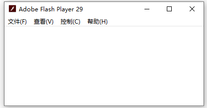
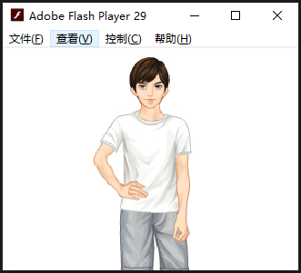
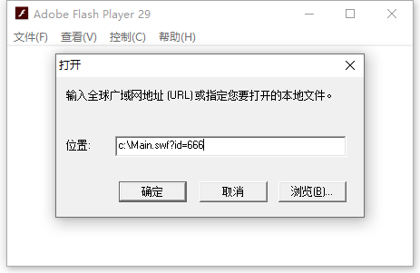
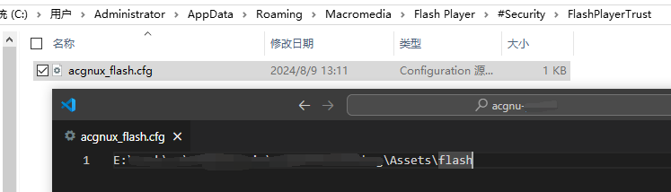

背景
---
本文再续 [某琴吧EXE播放器破解记录](../exe), 意在解决Adobe停止维护Flash后, 整个Flash失效导致播放器无法使用的问题. 

2020年末Adobe公司停止了对Flash的维护, 随之而来的是浏览器删除了对Flash的支持, 包括Windows系统内安装的Flash也无法继续使用, 而我们获取乐谱资源需要用到Flash版的某琴吧播放器, 之前使用的是`AxShockwaveFlash`, 这个组件也是引用了Windows上安装的Flash, 只能寻找其他替代方案

> 此文章编辑于2024年8月, 实际改造在2021年5月就已完成, 因此没有早期Flash失效截图. 另外某琴吧在2023年再次更新, 用手机版APP取代了PC版播放器, 后续的乐谱播放文件变更为`.ypn1` (通过前两次规律使用 `yp` 当前缀, 再加两位数组/字母用脚本穷举得出), 新格式只能在手机上用APP播放. 但暂不影响乐谱页的获取.

目标
---
使Flash版某琴吧播放器可用

分析
---
首先简单回顾一下破解过程, 我们先反编译了Flash版的某琴吧播放器, 然后在源码中增加了一个`swfExtGetypURL`方法, 此方法根据传入的乐谱ID返回乐谱资源URL, 再通过`ExternalInterface.addCallback`将该方法暴露给Flash容器, 我们就可以使用容器与Flash通信了. 而现在的问题是, 容器即`AxShockwaveFlash`组件由于Flash停止维护已经用不了了, 那么有没有什么办法能够继续运行Flash呢? 答案是有的, 我们还有另一种独立的Flash Player应用程序, 它不需要安装, 下载到电脑后双击即可运行



如上图所示, 启动之后界面是空白的, 因为没有运行Flash文件, 我们可以单击 文件 - 打开, 来选择一个`.swf`后缀的Flash文件进行播放, 例如下图是来自QQ秀的`.swf`文件运行效果



> 实际上当时下载到的最新版本为Adobe Flash Player 3x, 这些版本也受到了停止维护的影响无法使用, 直到我逐个尝试旧版之后才找到了可用的版本 29

**如何传入参数?**

根据 [某琴吧Flash播放器破解记录](../flash) 中的描述, 打开某琴吧播放器是需要传入一个`id`参数的, 那么这个图形化界面我们应该如何传入参数呢? 实际上我们可以手动在打开的文件后面键入`?id=xx`, 就可以把`id`参数传给某琴吧播放器了



**如何使用命令行启动?**

我们希望实际执行的时候由程序进行控制, 而不是每次都需要人为在界面上操作, 我们知道Windows可以通过命令行的方式启动`.exe`文件, 并附加执行参数传递给被执行的文件, 但前提是被执行文件支持命令行传参才行, 那么Flash Player是否支持呢? 答案是支持的, 我们可以通过以下方式来启动并播放一个Flash文件

```
flashplayer.exe file.swf?id=666
```

> 其实Flash Player是否支持传参, 以及具体传入格式并没有查到相关文档, 此处仅凭借经验以及猜测得知

**如何实现某琴吧播放器与Flash Player通信?**

很遗憾, 我们并不知道如何让Flash Player和某琴吧播放器通信, 因此我们不能采用之前外部接口的方式去获取乐谱资源, 但是我们可以依然可以改造一下某琴吧播放器, **此前是容器向某琴吧播放器发起调用获取到乐谱资源URL**, 现在可以**改造为某琴吧播放器启动后将乐谱资源URL参数通过HTTP主动请求到我们搭建的Web服务上**, 再由Web服务器解析后去下载乐谱资源

实践
---
**修改某琴吧播放器源码**

根据 [某琴吧Flash播放器破解记录](../flash) 我们知道要得到乐谱资源URL, 就需要调用`CLib.getURL`并传入乐谱ID, 在之前修改的基础上, 我们再次修改一下 `onSoundsReady` 方法, 如下所示

```
internal static function onSoundsReady(arg1:Event) : void
{
    swfLoader.contentLoaderInfo.removeEventListener(Event.COMPLETE,onSoundsReady);
    var loc1:* = swfLoader.contentLoaderInfo.applicationDomain;
    var loc2:* = loc1.getDefinition("Sounds") as Class;
    CLib.clib = loc2.cLibInit();
    if(utils.Func.ypadId != 0) {
        //由于 Flash Player 不可交互, 修改为启动时将琴谱地址上传, 宿主判断是否下载
        var url:* = CLib.getURL(utils.Func.ypadId);
        //url:* 结果为 http://www.和谐.com/flash_get_yp_info.php?ypid=66138&amp;sccode=77c83a7bf44542486ff37815ab75c147&amp;r1=9185&amp;r2=6640&amp;input=123
        var args:* = "?" + url.split("?")[1]
        urlLoader3 = new flash.net.URLLoader();
        urlLoader3.load(new flash.net.URLRequest(Config.flash_yuepu_fetch_URL + args));
    }
}
```
代码相较于之前的版本, 仅仅只是在初始化`CLib`之后, 增加了一个发起HTTP请求的代码, 具体解释如下
1. `utils.Func.ypadId`是某琴吧播放器启动后, 会把传入到播放器的`id`参数, 赋值于此
2. `CLib`初始化完成之后, 调用一次`CLib.getURL`, 得到该乐谱的资源URL
3. 通过字符串的`split`方法, 把原始资源文件地址中的域名和参数分割
4. 丢弃原始资源的域名部分, 将参数部分拼接到`Config.flash_yuepu_fetch_URL`后, 这是一个本地搭建的Web服务地址, 具体为 [http://localhost:7777/yuepu/fetch](), 而后`urlLoader3.load`将会发起HTTP请求

此时完整的流程为, 某琴吧播放器启动后, 初始化的方法`init1`中会调用`CLib.myLoadSwf`, 从而加载音色库, 当音色库加载完成之后, 就会调用回调函数`onSoundsReady`, 执行到上面的代码

**添加信任文件**

默认情况下, Flash Player 8 以后的版本<font color="red">禁止本地`.swf`发送Internet请求</font>, 可参阅 [关于Flash Player的安全说明](https://www.macromedia.com/support/documentation/en/flashplayer/help/settings_manager04.html#117502), 因此我们还需要为某琴吧播放器添加信任文件来解除限制

在Windows中的`%APPDATA%\Macromedia\Flash Player\#Security\FlashPlayerTrust`目录下创建一个`.cfg`文件, 文件名称随意, 例如`acgnux_flash.cfg`, 并添加需要被执行的`.swf`目录作为内容



当然, 我们也可以使用代码来自动化这个流程

```
public static void WriteTrustFile()
{
    var appDataPath = Environment.GetFolderPath(Environment.SpecialFolder.ApplicationData);
    FileUtil.SaveStringToFile(Environment.CurrentDirectory + @"\Assets\flash", appDataPath + @"\Macromedia\Flash Player\#Security\FlashPlayerTrust\", "acgnux_flash.cfg");
}
```

> 填写为目录表示该目录下所有`.swf`文件都受到信任, 也可以只填写单个`.swf`文件路径, 表示只信任这一个


**Web服务器中代码**

在本地搭建`7777`端口的Web服务, 并监听地址`/yuepu/fetch`请求, `C#`示例代码如下:

```
private void FetchPianoScore(HttpListenerContext httpListenerContext)
{
    //传入参数样本 ?ypid=29189&sccode=0373ef7aa7c3e092b8c4e09748574186&r1=8538&r2=5971&input=123
    Ypid = Convert.ToInt32(httpListenerContext.Request.QueryString["ypid"]),
    SheetUrl = string.Format("http://www.和谐.com/flash_get_yp_info.php?ypid={0}&sccode={1}&r1={2}&r2={3}&input=123",
    httpListenerContext.Request.QueryString["ypid"],
    httpListenerContext.Request.QueryString["sccode"],
    httpListenerContext.Request.QueryString["r1"],
    httpListenerContext.Request.QueryString["r2"])
}
```

我们将得到的四个核心参数, 与真正的资源服务器地址结合, 再次组合成完整的URL后就可以获取乐谱资源了

后续步骤
---
后续就比较简单了, 主要就是自动抓取乐谱, 在`C#`主要可以拆分为以下几个步骤

1. 自增得到一个乐谱ID, 通过`Process.Start`启动Flash Player

```
    Process.Start(new ProcessStartInfo()
    {
        FileName = "flashplayer.exe",
        Arguments = "Main.swf?id=666"
    });
```

2. 某琴吧播放器在Flash Player中运行之后, 会主动发起一个HTTP请求到[http://localhost:7777/yuepu/fetch]() 并附带关键参数
3. Web服务接收到请求之后, 可以根据传入的乐谱ID参数, 来判断这个乐谱文件是否已经下载过, 如果已经下载过, 则不做任何操作, 如果没有下载过, 则开始执行下载操作